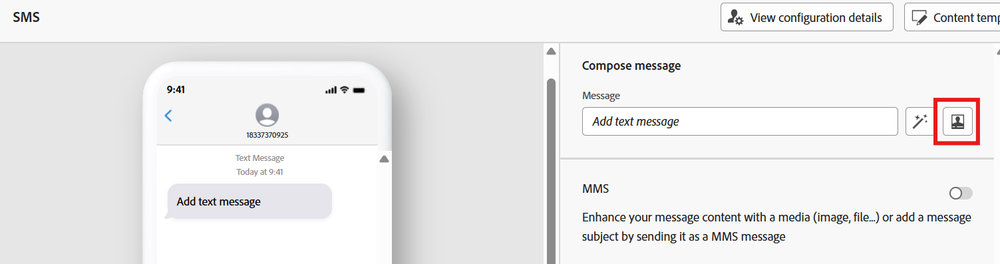

# 撰寫簡訊

## 目標

在接下來的幾個步驟中，您將撰寫非常簡單的SMS訊息。  您將瞭解如何輕鬆地在「極基本」層級新增某些內容，並根據關聯式存放區中的資料來個人化訊息。


## 導覽至內容

按一下&#x200B;**編輯內容**&#x200B;按鈕，或直接導覽至&#x200B;**內容**&#x200B;標籤


## 建立訊息

1. 按一下&#x200B;**Personalization**&#x200B;按鈕以建立您的訊息。

   

   >[!NOTE]
   >
   >「魔術棒」選項會使用AI來協助您撰寫訊息。 如果您願意，請檢視，但我們不會在本實驗室中涵蓋這些內容。


2. 將以下文字複製並貼到SMS訊息內文中。

   ```none
   Hi from Connection 5G! Your phone_make phone_model is eligible for a free upgrade to one of the new iPhone 17 models. Shop online or come into a store today to take advantage of this offer.
   ```

   >[!NOTE]
   >
   >請務必在訊息編輯器中將Word Wrap轉換為&#x200B;**開啟**。  您可以在視窗的右下窗格中找到。


3. 使用左側邊欄中的&#x200B;**Target屬性**&#x200B;選項，更新訊息中名為&#x200B;**phone\_make**&#x200B;及下方&#x200B;**phone\_model**&#x200B;的兩個欄位。  完成時，您的訊息應與熒幕擷圖相符。

   

   >[!NOTE]
   >
   >您為何要這麼做？  您想要使用客戶的電話機代號和型號來個人化訊息，此資訊會存放在關聯式商店的Customer Line表格中。  這示範了如何使用協調行銷活動的資料來個人化訊息。


4. 按一下編輯器上的&#x200B;**驗證**，並確定沒有驗證錯誤，若情況良好，請按一下&#x200B;**儲存**&#x200B;按鈕

   ![訊息編輯器中的[驗證]和[儲存]按鈕](assets/compose-the-sms-validate-and-save.png)


5. 完成返回工作流程畫布時，請按一下&#x200B;**上一頁箭頭(\&lt;-)**


## 重述

您剛才已建立訊息，希望現在可以更熟悉訊息編輯器的運作方式。  請記住，您可以使用關聯式存放區的資料進行個人化，也可以使用即時客戶設定檔的資料進行個人化！

>[!NOTE]
>
>如果您使用即時客戶個人檔案屬性來個人化協調行銷活動中的訊息，只要記得從資料湖中的個人檔案快照資料集提取訊息，以便屬性最久可以是24小時前的屬性。 設定檔快照在每日批次細分工作後每天只更新一次。
