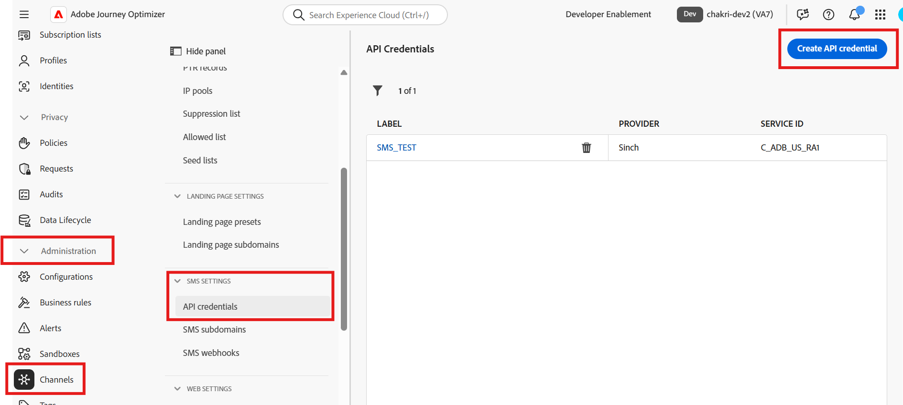
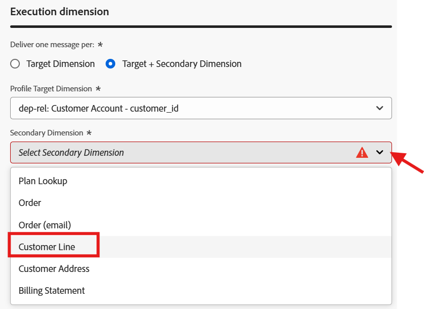

# 設定簡訊頻道

## 目標

在接下來的步驟中，您將設定SMS通道。 此為必要欄位，以便您稍後在建置行銷活動時，傳送訊息給個別的線路負責人。

## 導覽至管道

1. 在Adobe Journey Optimizer中，移至&#x200B;**管理** -> **管道**&#x200B;功能表。
1. 選取&#x200B;**API認證**→**SMS設定**。
1. 按一下&#x200B;**建立API認證**。

## 定義SMS API認證

首先，請建立AJO用來傳送傳出SMS請求的API聯結器。

1. 在SMS供應商底下，選擇&#x200B;**Twilio**。
1. 使用您自己的[Twilio試用帳戶](https://www.twilio.com/try-twilio)，輸入下列API認證詳細資料：
   - **名稱：** `DEP SMS`
   - 在您的Twilio主控台儀表板上找到&#x200B;**帳戶SID：**
   - 在您的Twilio主控台儀表板上找到&#x200B;**驗證權杖：** （按一下&#x200B;**檢視**&#x200B;以顯示它）
1. 按一下&#x200B;**提交**&#x200B;以註冊API認證

>[!NOTE]
>
>在開始此步驟之前，您需要一個擁有已驗證電話號碼的免費Twilio試用帳戶。 在[twilio.com/try-twilio](https://www.twilio.com/try-twilio)註冊，然後在Twilio主控台儀表板上找到您的帳戶SID和驗證權杖。

Twilio廠商的

## 建立SMS頻道設定

現在，您會將此API認證對應至歷程和行銷活動可使用的管道設定。

1. 瀏覽至&#x200B;**管道** → **一般設定** → **管道設定**。

![瀏覽到[一般設定]下的頻道設定](assets/configure-sms-channel-navigate-channel-configurations.png)

&#x200B;2. 按一下&#x200B;**建立通道組態**。

&#x200B;3. 在SMS通道組態設定中填入下列值：
   - **名稱：** `Relational-SMS-Multi-Entity`
   - **頻道：** `Mobile Message`
   - **行銷動作：** `SMS Targeting`

&#x200B;> [!NOTE]
>
>如果您收到錯誤訊息，指出使用者沒有許可權，請忽略該錯誤訊息並繼續。

## 簡訊設定

選取「頻道」作為「行動訊息」時，會顯示名為「簡訊設定」的新區段。 填入下列詳細資料：

- **行動訊息型別：** `Marketing`
- **行動訊息設定：** `DEP SMS`
- **寄件者號碼：** `01234567890`
- **子網域：** `leave blank`
- **選擇退出號碼：** `leave blank`

## 執行詳細資料

1. 在執行詳細資訊下，按一下索引標籤&#x200B;**協調的行銷活動**

&#x200B;2. 確認已核取&#x200B;**已啟用**&#x200B;核取方塊

&#x200B;3. 在子區段&#x200B;**執行維度**&#x200B;下方，確定下列設定如下：
   - **傳遞訊息給每：** `Target + Secondary Dimension`
   - **設定檔目標Dimension：** `dep-rel: Customer Account - customer_id`
   - **次要Dimension：** `Customer Line`

中，將次要Dimension設為「客戶行」

>[!NOTE]
>
>這可告知「協調的行銷活動」，當它傳送訊息時，應該針對符合設定檔目標Dimension的每筆記錄，傳送一則訊息。

&#x200B;4. 在執行位址標題下，確定您選取&#x200B;**次要Dimension**&#x200B;的選項按鈕，然後按一下&#x200B;**簡訊執行欄位**&#x200B;上的編輯按鈕

&#x200B;5. 在快顯視窗中，按一下結構描述&#x200B;**dep-rel： Customer Line**，然後選取&#x200B;**行動電話**。

Dep-rel的

&#x200B;6. 確認最終執行詳細資訊區段符合以下內容

## 提交並檢閱

1. 您可以按一下&#x200B;**提交**&#x200B;按鈕以完成設定，並看到成功訊息

提交頻道設定後

&#x200B;2. 在通道設定詳細目錄頁面上，在繼續之前，請確定狀態顯示為&#x200B;**作用中**

![頻道設定狀態顯示為[作用中]](assets/configure-sms-channel-active-status.png)

>[!CAUTION]
>
>等到狀態變成&#x200B;**作用中**&#x200B;為止，否則未來的實驗室步驟將會非常失敗

&#x200B;3. 當狀態變成「作用中」時，表示您已完成！

>[!TIP]
>
>🚀 Booyah！ 您的SMS頻道現在已上線並準備好採取行動！

## 重述

您現在已瞭解如何成功設定簡訊頻道。  請注意，這是以API為基礎的SMS，因此根據您的提供者，他們可能會使用替代方法進行驗證。

若您有興趣，請參閱[此處](https://experienceleague.adobe.com/zh-hant/docs/journey-optimizer/using/channels/sms/configure-sms/sms-configuration)以瞭解詳情。
