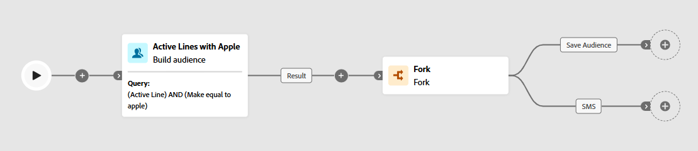

# 取用結果

## 目標

此步驟相當簡單，因為您只需新增「分支」活動即可，如此一來，您便可在未來步驟中複製結果，以利執行兩項不同的動作：

1. 儲存對象以供其他人用於廣告或跨頻道目的
1. 傳送SMS訊息至個別行。

## 建立分支

1. 在工作流程畫布上，在建立對象活動後按一下&#x200B;**+** **圖示**，並選取&#x200B;**分叉活動**

&#x200B;2. 按一下轉接，然後指定名稱，來更新分叉中的每個轉接的名稱，如下所述：
   - **前** —> `Save Audience`
   - **底部** —> `SMS`

完成時，您的畫布現在看起來應該像這樣……

新增Fork活動後

>[!NOTE]
>
>分叉活動實際上只是將前一個活動的結果複製到兩個獨立分支中

&#x200B;3. 按一下工作流程畫布頂端的&#x200B;**儲存**。

工作流程畫布工具列上的

>[!TIP]
>
>這相當困難，不是嗎😁

## 重述

請注意，您已建立結果的復本（即重複結果），這可讓您清楚指定分支以處理「儲存對象」，而另一個分支可用於SMS傳送。

>[!NOTE]
>
>如果您計畫將對象儲存為「儲存對象」活動不允許活動依循儲存對象，則需要使用Forks。
