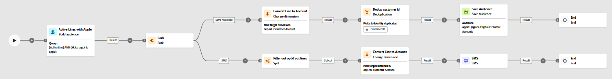
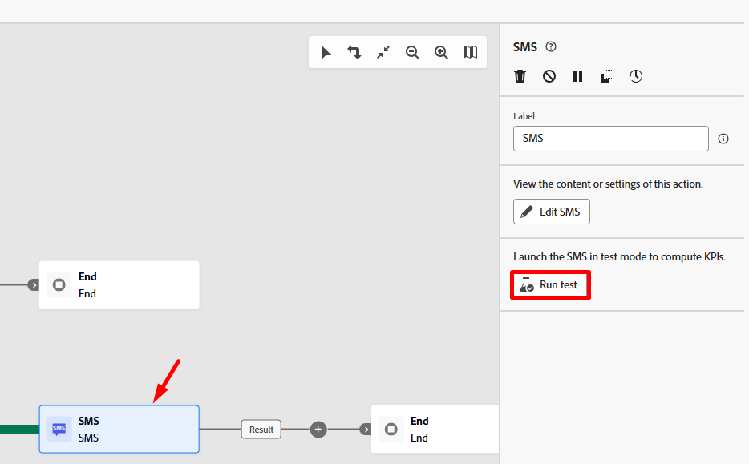
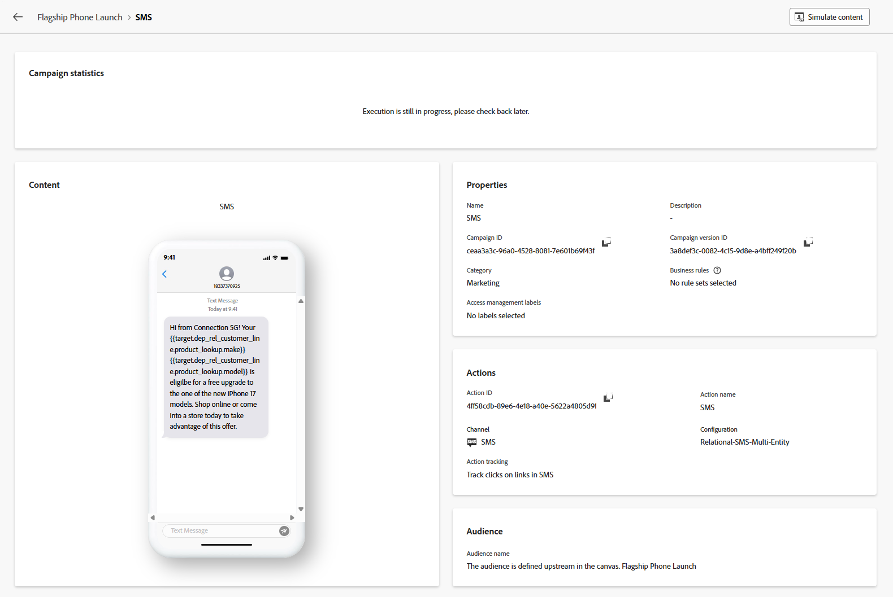
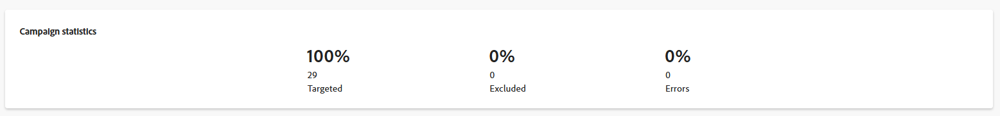

# 執行工作流程

## 目標

在接下來的幾個步驟中，您將瞭解如何使用測試模式來測試工作流程，以及更重要的，使用測試模式來測試簡訊活動。

## 驗證工作流程

1. 完成後，最終工作流程將類似於以下內容。 仔細檢查所有專案是否正常。 您會看到：

2. 如果您尚未停止工作流程，請按一下右上角的&#x200B;**停止**&#x200B;按鈕，確定您現在已停止工作流程。

工作流程右上角的

>[!NOTE]
>
>您可以選擇按一下「重新啟動」按鈕，但您可能會看到錯誤，因為您在工作流程建立後新增了活動，而且其快取不再有效。

3. 接著，按一下&#x200B;**開始**&#x200B;按鈕，執行並測試工作流程端對端

4. 按一下&#x200B;**結果** （有兩個結果，因此請使用下方所示的左側一個），然後在左側邊欄中按一下&#x200B;**預覽結果**&#x200B;按鈕，以檢閱進入簡訊活動的結果。

在SMS活動之前選取

右側邊欄中的

5. 您會看到&#x200B;**33筆記錄**，且目標維度符合客戶ID （若要設定檔則為聯結索引鍵）

的目標維度

## 測試簡訊活動

1. 關閉上一個視窗並按一下&#x200B;**簡訊活動**，然後按一下右側邊欄中的&#x200B;**執行測試**&#x200B;按鈕

在SMS活動上

2. 新按鈕幾乎立即出現，標籤為&#x200B;**檢視報告**。  按一下「**檢視報表**」按鈕以啟動至報表畫面。

SMS活動測試的

>[!NOTE]
>
>此畫面一開始不會填入，因為執行測試回合需要一些時間。 您可能需要重新整理幾次才能看到結果。

3. 當您取得結果時，您會看到100%已鎖定目標！

*等等，一分鐘……傳入的結果是33筆記錄，那麼4筆記錄移至何處？*

4. 返回工作流程畫布並按一下進入簡訊活動的轉變&#x200B;**結果**，然後按一下右側邊欄中的&#x200B;**預覽結果**。

5. 在預覽結果畫面中，一直捲動至表格底部，您注意到&#x200B;**4記錄**&#x200B;具有&#x200B;**空白的目標維度**。

底部具有空白的目標維度

## 說明

以下是發生的情況。

- 您有33個要傳送SMS訊息的客戶行
- 在變更維度活動4之後，這些客戶明細行沒有相關聯的客戶帳戶
- 若要加入Real-Time Customer Profile，您必須擁有客戶ID，而且由於這4筆記錄中沒有任何資料，因此無法立即查詢設定檔或建立新設定檔

結果 — >協調的行銷活動在訊息執行時捨棄這4筆記錄

>[!NOTE]
>
>我們推出一項增強功能，可透過兩種方式協助解決此問題：
>
>1. 請務必針對傳送時缺少目標維度的記錄建立排除記錄
>2. 更新「變更」維度活動以執行內部聯結與外部聯結，後者會將這4筆記錄預先刪除

>[!TIP]
>
>恭喜！ 您現在已獲得正式認證，可推出專屬的協調行銷活動，並向全世界廣播訊息，我們希望這能成為負責任之舉。 像宏偉的數位精靈一樣走向市場！

## 發佈工作流程

您不打算在實驗室中執行此動作，但根據內容說明以下是發佈時發生的動作：

1. 如果行銷活動已設定排程，則排程器會啟動
1. 「儲存對象」活動會在對象入口網站中建立對象殼層，而合格的設定檔會開始內嵌
1. 訊息執行從工作流程中的第一個訊息活動開始
   - 對設定檔快照進行設定檔查詢
     - 相符的設定檔會遵循在設定檔上找到的同意
     - 會即時建立不相符的設定檔
   - 在`AJO Message Feedback Event Dataset`中建立傳遞記錄
