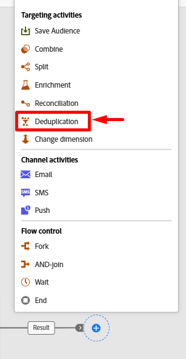

# 儲存對象

## 目標

在接下來的幾個步驟中，您會將您建立的對象儲存回Audience Portal，讓Adobe Experience Platform及其應用程式中的其他解決方案可針對自己的使用案例加以運用。

## 變更維度

1. 在工作流程畫布上，按一下&#x200B;**儲存對象**&#x200B;分支上的&#x200B;**+** **圖示**，然後從活動清單中選取&#x200B;**變更維度**&#x200B;活動

&#x200B;2. 更新變更維度的屬性，如下所示：
   - **標籤：** `Convert Line to Account`
   - **新目標維度：** `dep-rel: Customer Account`

>[!NOTE]
>
>**您為何要這樣做？請問？**  請記住，若要加入即時客戶設定檔（您儲存對象到的位置），必須使用您設定的設定檔目標對應，該對應僅能從dep-rel：客戶帳戶結構描述加入。

&#x200B;3. 完成後，這是您畫布的外觀。  儲存您的工作！

新增變更維度活動後

## 刪除重複結果

1. 在變更維度活動後按一下&#x200B;**+** **圖示**，並從活動清單中選取&#x200B;**重複資料刪除**&#x200B;活動

&#x200B;2. 將重複資料刪除活動的標籤更新為`Dedup customer id`

&#x200B;3. 現在按一下&#x200B;**+新增屬性**&#x200B;按鈕，並從標題為&#x200B;**客戶ID**&#x200B;的結構描述中選取欄位

從結構描述中選取的客戶識別碼欄位

&#x200B;4. 在「重複資料刪除」設定下，確定您有以下設定：
   - **要保留的重複專案：** `1`
   - **重複資料刪除方法：** `Random selection`

>[!NOTE]
>
>重複資料刪除的其他選項可讓您指定自己的自訂邏輯。  大部分時間，如果您需要刪除重複資料，則會使用表格的主索引鍵執行此操作。

&#x200B;5. 完成後，您的畫布看起來像這樣。 在繼續之前，請按一下右上方的&#x200B;**儲存**&#x200B;按鈕。

## 新增儲存對象活動

1. 在重複資料刪除活動後按一下&#x200B;**+**&#x200B;圖示，然後選取&#x200B;**儲存對象**&#x200B;活動

&#x200B;2. 在右側欄中，將活動的屬性設定如下：
   - **對象標籤**： `Apple Upgrade Eligible Customer Accounts`
   - **設定檔對應欄位**： `dep-rel: Customer Account - customer id`

>[!NOTE]
>
>「設定檔對應欄位」是您先前設定的專案，好讓關聯式存放區可以聯結至即時客戶設定檔。  設定檔已模型化為「客戶帳戶」層級，因此您要將對象儲存在相同層級。  因此，需要變更維度和重複資料刪除。

## 對象欄位對應

預設會將目標維度的主索引鍵（即客戶ID）作為欄位新增至對象。 如果您檢視右側並展開欄位，即可看到此內容。  請注意兩件事：

- **Source對象欄位** —>參考來自關聯式結構描述的欄位
- **目標對象欄位** —>將隨著對象儲存而建立的欄位名稱

>[!NOTE]
>
>請注意「目標對象」欄位的名稱是`Dep_rel_customer_account_Customer_id`的程度。  您應該隨時將此變更為行銷人員更容易辨識的內容，無需託辭。

## 修正預設對象欄位

1. 將預設的目標對象欄位重新命名為&#x200B;**Customer\_ID**，如下所示：

>[!TIP]
>
>現在您有了人類可辨識的欄位名稱🎉

&#x200B;2. 按一下&#x200B;**開始**&#x200B;按鈕以執行工作流程。 您的工作流程現在看起來像這樣，而您會看到如下的計數：
   - 建置對象： `65`
   - 將行轉換為帳戶： `65`
   - 重複資料刪除客戶ID： `46`

>[!NOTE]
>
>儲存閱聽眾活動只會在工作流程發佈時建立閱聽眾，而不會在工作流程啟動時建立。 建立對象時，會包含您新增的所有屬性，並會在下次排程的每日細分服務工作執行期間，加入即時客戶設定檔。

>[!CAUTION]
>
>不要發佈您的工作流程！

## 挑戰

如果您在儲存對象前沒有進行重複資料刪除，會發生什麼情況？  對象會儲存全部65筆記錄還是僅儲存46筆記錄？

## 回答

對象將會儲存所有65筆記錄，但讀取對象活動將會根據加入條件😁在匯入時刪除重複資料

## 重述

您現在應該清楚瞭解「儲存對象」的運作方式，以及重複資料刪除重要的原因。  請記住，您一律需要定義設定檔目標對應，因為關聯式存放區資料必須知道如何聯結至即時客戶設定檔。  設定檔目標對應是連線條件🙂
