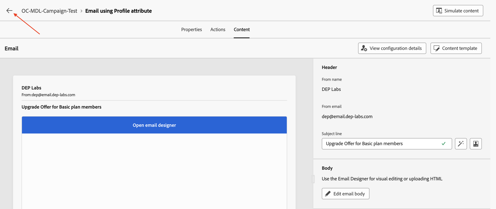

# 新增電子郵件活動

## 目標

在接下來的幾組步驟中，您將建置促銷活動，以將兩個電子郵件活動新增至兩個復本活動分支。 您將設定兩個電子郵件活動以使用先前建立的電子郵件頻道。 最後，您也會將基本電子郵件設定（主旨與內文）新增至這些電子郵件活動的每一項中。

>[!CAUTION]
>
>在繼續之前，您必須確定您的兩個電子郵件通道設定在其狀態中都顯示為作用中。
>
>

## 新增主要分支電子郵件活動

1. 按一下頂端流程的&#x200B;**+**，並從&#x200B;**頻道活動**&#x200B;中選取&#x200B;**電子郵件**

**電子郵件**&#x200B;詳細資料窗格開啟

2. 使用&#x200B;**電子郵件**&#x200B;活動的設定檔屬性&#x200B;**，將標籤重新命名為**&#x200B;電子郵件，然後按一下&#x200B;**編輯電子郵件**。 請注意，建立電子郵件內文僅供測試之用

![重新命名電子郵件活動標籤，然後按一下[編輯電子郵件]](assets/add-email-activities-rename-and-edit-email.png)

3. 選取「**動作**」標籤，然後從下拉式清單中選取「**設定檔 — 電子郵件**」頻道設定

![在[動作]索引標籤中選取設定檔 — 電子郵件通道設定](assets/add-email-activities-select-profile-email-channel.png)

4. 接著，按一下&#x200B;**編輯內容**&#x200B;以新增一些測試內容

![按一下[編輯內容]以新增測試內容](assets/add-email-activities-edit-content.png)

5. 提供&#x200B;**主旨列** （「基本計畫成員的升級優惠」），然後按一下&#x200B;**編輯電子郵件內文**&#x200B;按鈕

6. 有許多選項，對於此測試，請選擇&#x200B;**自行編碼** HTML選項

7. 在&#x200B;**電子郵件Designer**&#x200B;中，插入測試行「有可用的升級優惠！」 在所示的`</body></html>`標籤之前，按一下&#x200B;**儲存**

![在電子郵件Designer中插入測試行並按一下[儲存]](assets/add-email-activities-email-designer-save.png)

8. 等候確認訊息出現在右下角

9. 按一下&#x200B;**電子郵件Designer**&#x200B;旁的&#x200B;**向左箭號**&#x200B;結束

10. 確認對話方塊隨即出現，請按一下&#x200B;**儲存並關閉**&#x200B;按鈕

![含有[儲存並關閉]按鈕的確認對話方塊](assets/add-email-activities-save-and-close-dialog.png)

11. 檢閱電子郵件屬性和動作，包括新增至電子郵件內文的文字。 按一下&#x200B;**向左箭頭**&#x200B;以導覽回促銷活動畫布

## 新增底部分支電子郵件活動

回到行銷活動畫布，按一下底部流程的&#x200B;**+**，並從&#x200B;**頻道活動**&#x200B;中選取&#x200B;**電子郵件**。 請遵循上述相同步驟（步驟2至11），但以下步驟除外：

- 針對&#x200B;**電子郵件**&#x200B;活動，使用Target Dimension **將標籤重新命名為**&#x200B;電子郵件
- 在電子郵件設定中，選擇&#x200B;**關聯式電子郵件**&#x200B;電子郵件通道設定

## 重述

您現在已瞭解如何使用電子郵件通道設定電子郵件活動。 每個活動接著都會設定非常基本的電子郵件主旨與內文。 接下來將測試整個行銷活動。
