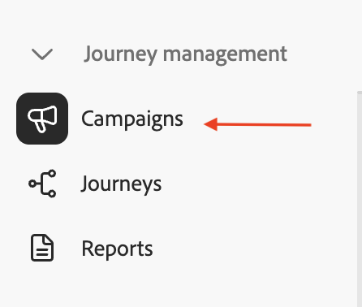

# 建立行銷活動

## 目標

在接下來的幾個步驟中，您將從建立協調的行銷活動開始。

## 建立行銷活動

1. 在左側邊欄中，按一下&#x200B;**行銷活動**

&#x200B;2. 按一下&#x200B;**建立行銷活動**

&#x200B;3. 選取&#x200B;**協調流程 — 行銷**&#x200B;並按一下&#x200B;**確認**

![選取協調流程 — 行銷並按一下[確認]](assets/create-a-campaign-select-orchestration-marketing.png)

&#x200B;4. 在下方提供行銷活動詳細資料，然後在完成時按一下&#x200B;**儲存按鈕**
   - **名稱：** `OC-MDL-Campaign-Test`
   - **描述：** `OC Message Delivery Test`

![提供行銷活動詳細資料，然後按一下[儲存]](assets/create-a-campaign-provide-campaign-details.png)

&#x200B;5. 請等候確認訊息，然後再繼續

## 重述

您已建立協調的行銷活動，並設定所有基本設定，這些設定將用於下一組步驟。
