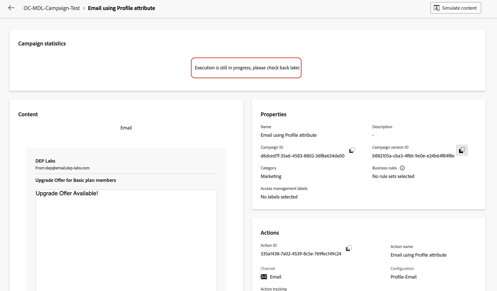

# 測試行銷活動

## 目標

在接下來的幾組步驟中，您將在測試模式下執行行銷活動，以在發佈行銷活動之前確認行銷活動如預期般運作。 在這種情況下，測試模式不會實際傳送電子郵件，但有助於驗證整個流程並及早識別問題。

## 開始工作流程

1. 設定兩個電子郵件流程後，行銷活動會如下所示。 按一下&#x200B;**開始**&#x200B;按鈕，在&#x200B;**測試模式**&#x200B;中執行行銷活動

   ![按一下[開始]以測試模式執行行銷活動](assets/test-the-campaign-click-start-test-mode.png)

   >[!NOTE]
   >
   >如上一個實驗室所述，測試模式可讓您驗證行銷活動執行及各種活動的結果。 每個活動都會依序執行，直到達到流程結尾為止。

2. 所有行銷活動的測試執行開始，驗證結果

## 以電子郵件傳送報表#1裝

1. 若要測試電子郵件傳遞，請使用設定檔屬性&#x200B;**活動按一下**&#x200B;電子郵件，然後在右窗格中按一下&#x200B;**執行測試**

   

2. 等候確認訊息，然後按一下&#x200B;**檢視報告**&#x200B;以檢視電子郵件測試的詳細資料

   ![按一下[檢視報告]檢視電子郵件測試詳細資料](assets/test-the-campaign-view-report-1.png)

3. 電子郵件報告頁面會顯示行銷活動統計資料和執行狀態。 電子郵件測試是活動的驗證，以確保沒有錯誤並且不會傳送電子郵件。 通常需要大約\~**5**&#x200B;分鐘才能完成。

   

   >[!NOTE]
   >
   >您可能需要重新整理頁面幾次，才能檢視最終測試結果。

4. 電子郵件測試完成後，會顯示結果。 發生某些百分比的錯誤；按一下&#x200B;**檢視更多**&#x200B;以瞭解原因。

   

5. 原因狀態為`Email address not found in profile`

中找不到電子郵件地址

>[!NOTE]
>
>由於為電子郵件活動（使用設定檔屬性&#x200B;**的**&#x200B;電子郵件）設定的&#x200B;**傳遞地址**&#x200B;已設定為使用設定檔屬性`personalEmail.address`，因此其已建立對&#x200B;**AEP設定檔**&#x200B;的相依性。
>
>在關聯式結構描述中的&#x200B;**38**&#x200B;個合格客戶ID中，系統只能找到&#x200B;**7**&#x200B;個對應的AEP設定檔。 其餘的&#x200B;**31**&#x200B;個AEP設定檔不存在，因此產生`Email address not found in profile`錯誤訊息。
>
>請務必記住，在協調的行銷活動中使用AEP設定檔屬性時，datalake和關聯式存放區中的資料會保持&#x200B;**一致**。

## 以電子郵件傳送報表#2裝

1. 使用Target Dimension **活動對**&#x200B;電子郵件重複相同的程式

   

2. 等候確認訊息，然後按一下&#x200B;**檢視報告**&#x200B;以檢視電子郵件測試的詳細資料

   ![按一下[檢視報告]檢視電子郵件測試詳細資料](assets/test-the-campaign-view-report-2.png)

3. 電子郵件測試完成後，會顯示結果。 在此情況下不會有錯誤

>[!NOTE]
>
>由於使用Target Dimension **的電子郵件活動**&#x200B;電子郵件的&#x200B;**傳遞位址**&#x200B;已設定為使用關聯式結構描述中的`dep_rel_customer_account.email`，因此對AEP設定檔或其屬性沒有相依性。
>
>所有&#x200B;**38**&#x200B;合格客戶ID在關聯式存放區中都有對應的電子郵件，且可以順利鎖定目標，而不會發生任何錯誤。

## 停止工作流程

按一下&#x200B;**停止**&#x200B;按鈕以停止行銷活動的&#x200B;**測試模式**

>[!TIP]
>
>兩個電子郵件通道設定都在相同行銷活動中測試，並且觀察到使用AEP設定檔屬性和在電子郵件通道設定中使用Target Dimension之間的差異。
>
>恭喜，訊息傳遞實驗室到此結束。

## 重述

您現在已瞭解如何測試建立的行銷活動，以瞭解流量和行為。 在測試流程執行期間，我們已充分瞭解使用不同設定進行電子郵件通道設定的細微差別。

如果您有興趣，可以在[這裡](https://experienceleague.adobe.com/zh-hant/docs/journey-optimizer/using/campaigns/orchestrated-campaigns/launch/start-monitor-campaigns)閱讀更多有關行銷活動測試模式的資訊。
