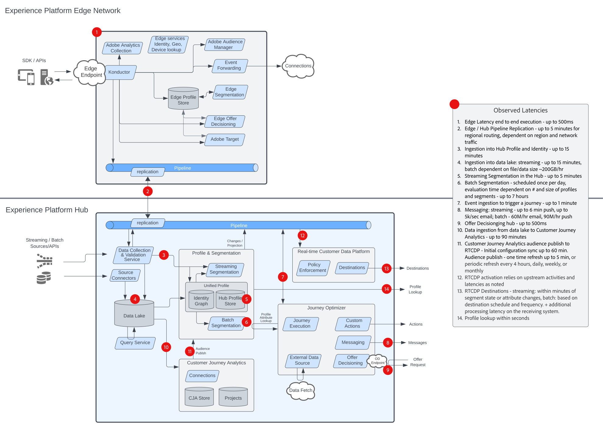

# 數位體驗 Blueprint

數位體驗藍圖提供系統和資料流程架構圖，以協助您更清楚瞭解Adobe Experience Platform和應用程式的整合與實作方式。 藍圖提供系統間和元件資料與內容流程、操作順序和相依性的視覺化表示，以協助告知Adobe Experience Platform和應用程式的使用案例設計和架構。

## 熱門藍圖

<table>
<tr>
  <td>
    
    

      <a href="experience-platform/guardrails.md">
    <strong>Experience Platform中心與Edge架構和護欄圖表</strong>
    </a>
    

  </td>
   <td>
    
    

      <a href="experience-platform/deployment/websdk.md">
    <strong>網頁SDK和Edge Network順序圖</strong>
    </a>
    

  </td>
  <td>
    
    

      <a href="customer-journeys/journey-optimizer.md">
    <strong>Adobe Journey Optimizer概觀圖表</strong>
    </a>
    

  </td>
</tr>
</table>

