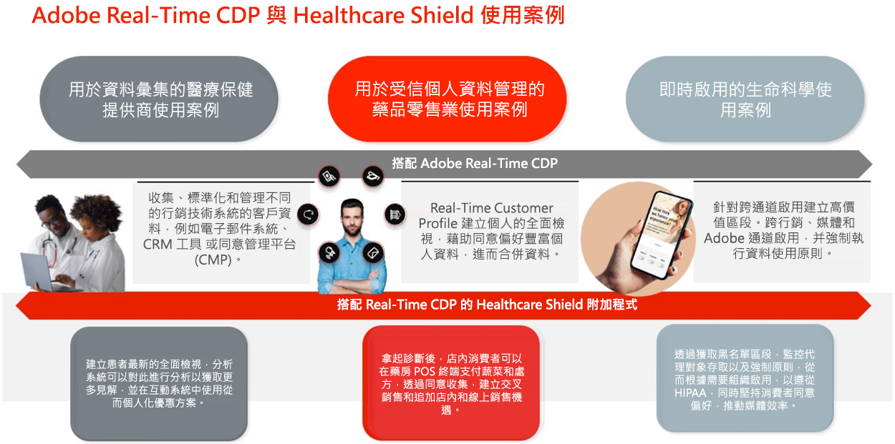
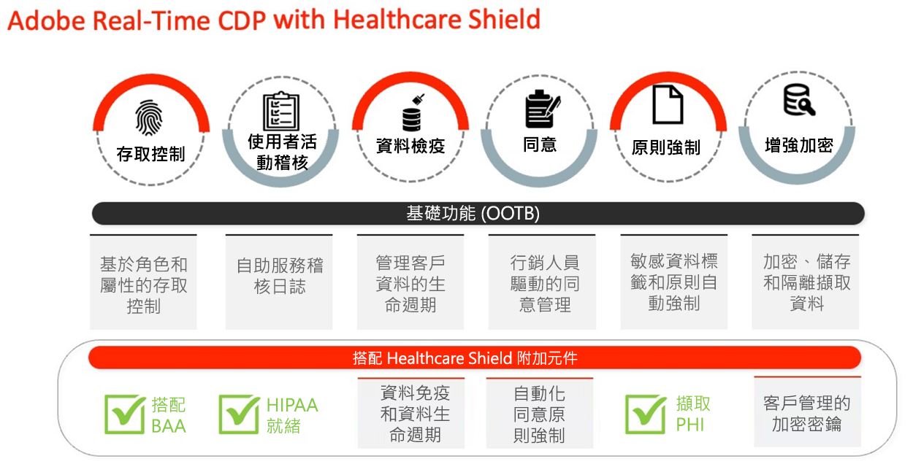
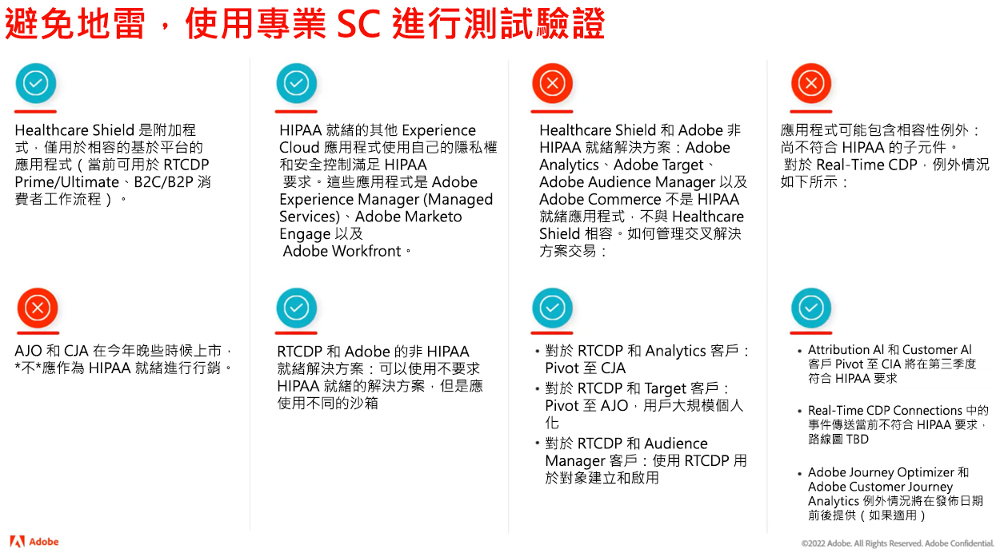
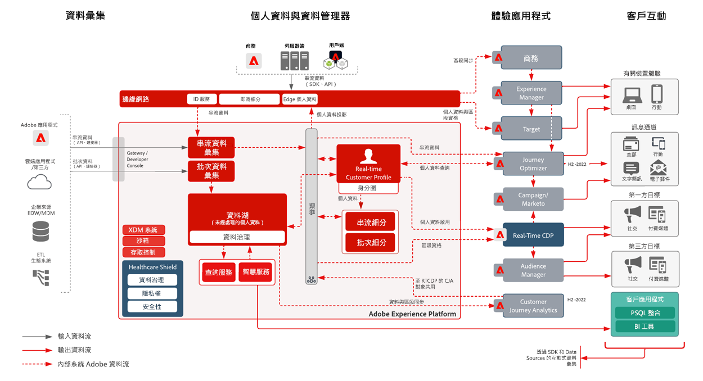
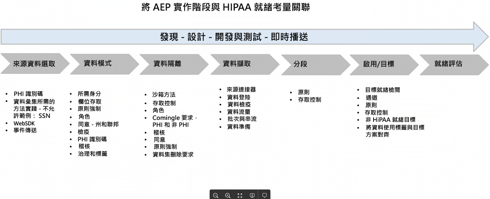
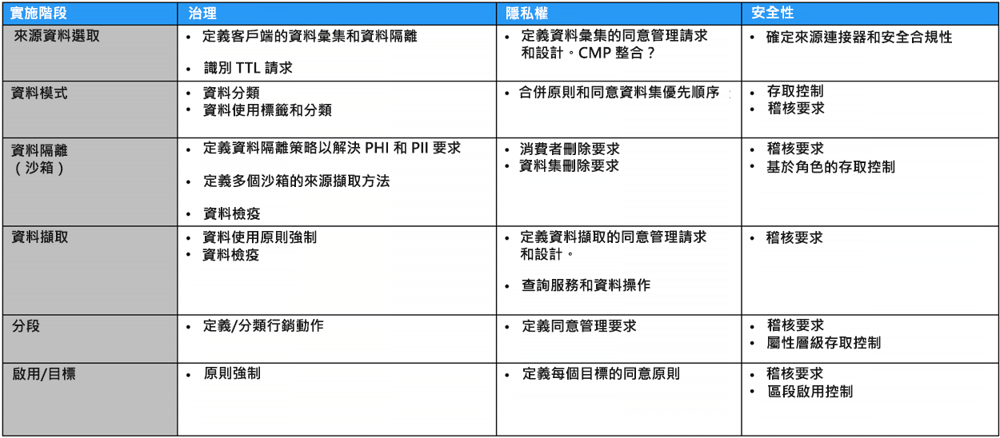

# 醫療保健盾

Healthcare Shield是基於Adobe Experience Platform的應用程式(如Real-Time CDP、Adobe Experience Platform和Adobe Journey Optimizer)的Customer Journey Analytics插件。 它旨在使這些應用程式能夠適應HIPAA，並滿足有關受保護健康資訊(PHI)的處理和使用的要求。

## 有關Healthcare Shield的常見問題

以下常見問題集提供了有關Healthcare Shield的常見問題的解答。

### 什麼是HIPAA?

HIPAA是《健康保險流通和責任法案》。 這是美國的一項法規，為企業確立了重要的保護。 這些保護限制了受保護的健康資訊(PHI)在由HIPAA覆蓋的實體或業務關聯方(如Adobe客戶)建立、接收、維護或傳輸到業務關聯方(如Adobe)時的使用和披露。

Adobe作為業務關聯方，在具體的HIPAA就緒型Adobe解決方案以及對HIPAA安全性、隱私和違規通知規則的合規性方面，HIPAA已經準備好。

### 什麼是業務協理協定(BAA)，為什麼它重要？

當覆蓋實體或業務關聯(Adobe客戶)使用業務關聯(如Adobe)的服務來建立、接收、維護或傳輸某些類型的消費者資料，即受保護的醫療保健資料(PHI)或ePHI（PHI的電子版本）時，覆蓋實體和業務關聯需要簽訂業務關聯協定(BAA)。

BAA合同要求Adobe，作為Business Associate，通過遵守HIPAA隱私、安全和違規通知規則的要求來適當保護PHI。

借助適用於Real-Time CDP的Healthcare Shield附加元件，Adobe現在能夠與授權此功能的客戶一起執行BAA，以及Adobe Real-Time CDP B2C和Adobe Real-Time CDP B2P版的消費者流。

### 為什麼Healthcare Shield for Real-Time CDP（以及未來基於平台的應用程式）只在美國提供？

由於HIPAA是美國法律，因此我們將Healthcare Shield的可用性限制在美國和受HIPAA管轄的公司。 Adobe打算將業務範圍擴大至其他司法轄區，因為我們考慮當地要求，並有信心能滿足這些要求。

### 什麼是Real-Time CDP的醫療保健盾？

Healthcare Shield for Real-Time CDP適用於屬於Covered Entity或Business Associate的客戶，他們打算在Real-Time CDP中使用PHI來獲取資料、建立受眾和跨渠道激活，並要求Adobe執行BAA。 Covered Entities with HIPAA需要Healthcare Shield才能實現Real-Time CDP的使用案例。

### 為什麼Real-Time CDP的醫療保健前景要購買Healthcare Shield?

作為Real-Time CDP的附加元件， Healthcare Shield將應用程式升級到「HIPAA就緒」狀態。 這意味著應用程式具有根據HIPAA要求使用PHI的防護。 此外，借助Healthcare Shield,Adobe願意並能夠授權客戶將某些類型的允許的敏感個人資料帶入HIPAA就緒型應用程式。 Adobe與客戶簽署業務協理協定(BAA)，這些客戶為基於平台的相容應用程式授予Healthcare Shield許可。

### 使用Healthcare Shield為Real-Time CDP授權的資料類型是什麼（哪些不是）?

使用Healthcare Shield，各品牌可能將以下PHI納入基於平台的應用程式，如Real-Time CDP（允許的敏感個人資料）:

* 個人的財務資訊
* 醫療
* 健康資訊

但是，我們明確排除了識別未成年人濫用藥物、精神健康、遺傳健康記錄或健康記錄的資料，完整賬號、完整信用卡號、政府標識符（如SSN）以及兒童個人資訊。 兒童受任何兒童保護法(例如美國兒童線上隱私法(COPPA)所定義的個人資訊)的保護。

### 使用Healthcare Shield,Real-Time CDP客戶是否可以使用任何類型的PHI來構建受眾並激活它們？

即使客戶可能將允許的敏感個人資料帶入平台原生應用程式，客戶也需要了解，他們應全權負責遵守所有適用法規，並從消費者處獲得適當的權限、同意、許可和授權，以便以預期方式使用資料。

### 使用非HIPAA就緒型Adobe應用程式來獲取和激活客戶資料有何細微差別？

授權Healthcare Shield的客戶不得使用、獲取、收集、共用或將允許的敏感個人資料與任何非HIPAA就緒型Adobe應用程式和服務整合。

例如，客戶不應啟用Audience Manager、Adobe Target和Adobe Analytics等應用程式中包含PHI的區段。 許可Healthcare Shield的客戶可以將允許的敏感個人資料或授權的PHI嵌入到HIPAA就緒型Adobe應用程式中，而不管該資料源是否認為HIPAA就緒。

### 利用非HIPAA就緒型非Adobe應用程式來獲取和激活客戶資料有何細微差別？

客戶授權Healthcare Shield時，應做出正確判斷，以確定他們在何處激活在Adobe應用程式之外包含PHI的段。 Adobe不控制（且不負責）第三方提供者以及客戶傳送給第三方提供者的資料，該第三方提供者可能不支援根據客戶結構中的Adobe資料使用標籤處理資料。 此外，Adobe無法為客戶提供法律建議。

## Healthcare Shield的關鍵使用案例

| RTCDP B2C版標準使用案例 | 說明 |
|-----|-----|
| 串流資料收集 | <ul><li>可跨Adobe和非Adobe連接使用的標準化、靈活的資料模型<li>專為B2C行銷設計的人員和帳戶型資料結構<li>標籤管理和事件轉送會即時收集和分發事件層級資料。<li> 最佳化設定檔，可加速體驗提供時間</li></ul> |
| 受信任的配置檔案管理 | <ul><li>包含消費者屬性、行為和偏好資料的統一設定檔<li> 資料治理框架靈活、透明，並且通過策略建立和自動強制執行應用於統一配置檔案，以防止資料濫用。 </li></ul> |
| 即時啟動 | <ul><li>專為B2C行銷人員設計的拖放區段<li>跨管道啟用的人員和帳戶層級身分解析和設定檔擴充<li> 跨通路和環境(Adobe和非Adobe)透過受眾協調和即時啟動來提供一致的客戶體驗 </li></ul> |
| 客戶贏取 | <ul><li>轉換未驗證給已識別/已驗證使用者的深入分析<li>鼓勵未註冊的用戶註冊成員資格。<li> 增加和/或贏回訂閱<li> 分析客戶設定檔以了解傾向(例如. 比較高價值區段與表現欠佳的區段，並針對贏取進行最佳化)</li></ul> |
| 客戶參與 | <ul><li>根據消費者行為時近和對選件的頻率動作來鎖定選件（線上和離線）<li>統一連線體驗的數位屬性（例如鼓勵行動應用程式下載，並跨管道使用區段啟用來連線體驗）</li></ul> |
| 大規模個人化 | <ul><li> 評估邊緣上的區段，以即時同一頁面和下一頁個人化<li>為在歷程中放棄工作階段的訪客（例如放棄購物車、重複無法轉換的訪客）提供獨特且具有目標的體驗，以提高參與度。<li> 統一並連結離線和線上行為，以最佳化和吸引使用者</li></ul> |
| 交叉銷售/向上銷售 | <ul><li>在客戶增長的同時保留客戶並保持與用戶的現有關係<li>透過跨業務單位/品牌/優惠方案創造新的收入流，創造客戶終生價值<li>獲得產品和SKU之間AOV的深入分析（例如頻繁的套件組合、價格敏感性）</li></ul> |
| 客戶保留率/忠誠度 | <ul><li> 重新啟用消費者以提升忠誠度並避免客戶流失<li>根據偏好和傾向為高價值客戶組織個人化產品建議<li>為參與建立標準順序，並為忠誠消費者提供特別優惠<li> 連結線上和離線偏好設定，以最佳化各管道的優惠方案</li></ul> |
| 資料協作 | <ul><li> 在UI中建立握手，以建置資料協作工作流程。<li>(運用跨行業的第一方資料重疊，以便做出明智的策略性業務決策和行銷活動。<li>打破資料孤立環境，了解整體客戶歷程<li> 根據使用案例遵守偏好設定和同意</li></ul> |
| 媒體/行銷效率與最佳化 | <ul><li> 在一個記錄系統中集中並維護客戶資料和激活渠道，從而提高組織效率<li>支援抑制促銷活動以提高媒體支出/效率<li> 通過治理和策略實施與IT政策相協調<li>視需要即時提供資料存取權，以支援及時的行銷活動</li></ul> |

## 相關技術能力

### 差異

| 類型 | 立即可用 | 醫療保健盾 |
|-----|-----|-----|
| 加密 | [AEP中的資料加密](https://experienceleague.adobe.com/docs/experience-platform/landing/governance-privacy-security/encryption.html?lang=en) | [AEP中的資料加密](https://experienceleague.adobe.com/docs/experience-platform/landing/governance-privacy-security/encryption.html?lang=en) +客戶管理金鑰 |
| 資料衛生 | **基礎：** 可讓客戶管理資料生命週期的自助服務工具。 這包括刪除客戶資料、欄位層級更新，以及設定資料集的資料到期日，以在過期時移除資料。<ul><li>限制 **10,000個刪除請求** 每月<li>2個資料集TTL的上限</li></ul> | **Premium**:延長「資料衛生」功能的每日容量/臨界值，以更短的時間組織大型資料集。<ul><li>限制 **2,000,000個刪除請求** 作為HealthCare Shield的一部分<li>20個資料集TTL的上限</li></ul> |
| 同意 | **基礎**:手動將同意和偏好相關屬性新增至受眾細分，以精細顯示同意和偏好設定。 | **Premium**:根據同意和偏好設定，建立並自動執行關於如何使用客戶資料的原則。 |

### 治理

**資料衛生**

* [資料衛生概觀](https://experienceleague.adobe.com/docs/platform-learn/tutorials/data-hygiene/overview.html?lang=en)
* [Adobe Experience Platform資料衛生](https://experienceleague.adobe.com/docs/experience-platform/hygiene/home.html?lang=en)

**政策執行**

* [資料控管概觀](https://experienceleague.adobe.com/docs/experience-platform/data-governance/home.html?lang=en)
* [資料使用原則概觀](https://experienceleague.adobe.com/docs/experience-platform/data-governance/policies/overview.html?lang=en)
* [Adobe Experience Platform的控管、隱私權及安全性](https://experienceleague.adobe.com/docs/experience-platform/landing/governance-privacy-security/overview.html?lang=en#consent)

### 隱私權

**同意**

* [自動策略實施](https://experienceleague.adobe.com/docs/experience-platform/data-governance/enforcement/auto-enforcement.html?lang=en#consent-policy-evaluation)

### 安全性

**增強加密**

實用連結：

* [AEP安全性白皮書](https://www.adobe.com/content/dam/cc/en/security/pdfs/AEP_SecurityOverview.pdf)

* [Adobe Experience Platform中的資料加密](https://experienceleague.adobe.com/docs/experience-platform/landing/governance-privacy-security/encryption.html)

* [資料準備中的雜湊函式](https://experienceleague.adobe.com/docs/experience-platform/data-prep/functions.html?lang=en#hashing)

* [標籤資料加密](https://experienceleague.adobe.com/docs/experience-platform/tags/api/guides/encrypting-values.html?lang=en)

**存取控制**

* [基於屬性的訪問控制概述](https://experienceleague.adobe.com/docs/experience-platform/access-control/abac/overview.html)

**用戶活動審核**

* [稽核記錄](https://experienceleague.adobe.com/docs/experience-platform/landing/governance-privacy-security/audit-logs/overview.html)

**增強加密**

* [Adobe Experience Platform安全性概述](https://www.adobe.com/content/dam/cc/en/security/pdfs/AEP_SecurityOverview.pdf)
* [加密值](https://experienceleague.adobe.com/docs/experience-platform/tags/api/guides/encrypting-values.html?lang=en)
* [Adobe Experience Platform中的資料加密](https://experienceleague.adobe.com/docs/experience-platform/catalog/data-protection.html)
* [資料準備映射函式 — 散列](https://experienceleague.adobe.com/docs/experience-platform/data-prep/functions.html?lang=en#hashing)

**Experience Cloud**

* [Adobe Real-time Customer Data Platform與醫療盾](https://experienceleague.adobe.com/docs/customer-data-management-voices-events/events/governance/healthcare-shield.html?lang=en)

   實現體驗承諾，並能存取更少的資料。 在此視頻中，您將了解有關Adobe Real-Time CDP和Healthcare Shield的更多資訊，這是一種基於Adobe Experience Platform的應用程式的Adobe Experience Platform附加元件，旨在使這些應用程式準備好HIPAA，並滿足有關受保護健康資料(PHI)的處理和使用的HIPAA要求。

**Experience Platform**

* [稽核記錄概述](https://experienceleague.adobe.com/docs/experience-platform/landing/governance-privacy-security/audit-logs/overview.html)

   了解稽核紀錄如何讓您查看誰在 Adobe Experience Platform 中執行了哪些操作。

* [資料衛生概觀](https://experienceleague.adobe.com/docs/experience-platform/hygiene/home.html?lang=en)

   Adobe Experience Platform資料衛生功能可讓您更新或清除過時或不準確的記錄，以管理資料的生命週期。

* [自動策略實施](https://experienceleague.adobe.com/docs/experience-platform/data-governance/enforcement/auto-enforcement.html?lang=en)

   本檔案說明在Experience Platform中將區段啟用至目的地時，如何自動強制執行資料使用原則。

* [基於屬性的訪問控制概述](https://experienceleague.adobe.com/docs/experience-platform/access-control/abac/overview.html)

   了解Adobe Experience Platform中的屬性型存取控制。

## HIPAA和Adobe產品和服務

Adobe繼續創新和適應醫療保健行業客戶的需求，以滿足其特定的隱私和安全需求。

請參閱 [HIPAA和Adobe產品和服務](https://www.adobe.com/trust/compliance/hipaa-ready.html).

## 高階行銷架構圖

符合HIPAA要求（而非）的產品：

**行銷架構圖**

[Lucidchart源](https://lucid.app/lucidchart/8a795213-3bfa-43f3-a542-f0de56123afd/edit?invitationId=inv_d3183739-8c07-4ca2-bfd1-16d819b911a6&amp;page=0_0)

## 方法

本節說明實作步驟和面試階段。

### 實施階段

每個步驟要考慮的方面：

本節概述一些要遵循的最佳實務，並分為三個階段：

### 面試階段

與利益相關方的面談過程是了解以下方面的關鍵：

* 目標：使用案例類型 — 轉換、探礦、參與等
* 效能：任何服務級別目標期望
* 資料來源：網頁/分析、離線/線上、CRM、忠誠度等
* 資料量
* SLT/SLA要求
* 身分 — 身分數、驗證與匿名資料處理
* 資料格式：JSON、CSV等
* 資料質量，需要資料轉換
* 與合作夥伴進行區段比對（共用）的任何計畫
* 要匯入的任何外部對象
* 加密：預設與客戶管理金鑰
* 資料的混合：被視為e-PHI
* 同意資料收集 — OneTrust、同意SDK
* 目的地需求：頻率和延遲及存取控制需求
* 存取控制
* 資料清理需求
* 資料更新需求
* 警報需求
* API存取

### 設計階段

根據面試流程，設計階段將處理以下問題。 不用說，設計檔案需要審查和簽核。 設計文檔可涵蓋以下方面：

* 資料的值：
   * 卷 — 資料攝取量
   * 時間範圍 — 擷取的資料應存留的時間長度
   * 保真度 — 設定檔豐富度
* 考慮AEP護欄以及SLT/SLA要求
* 授權使用
* 資料隔離需求 — 單個或多個組織中有多個沙箱
* 資料篩選
* 資料衛生要求（資料量和頻率）
* 滿足資料刪除/更新要求的流程和方法
* 資料轉換需求 — 上游、資料準備、查詢服務
* 了解並判斷主要身分和其他身分
* [XDM架構設計](https://experienceleague.adobe.com/docs/experience-platform/xdm/schema/composition.html?lang=en)
* 確定資料集數，已配置資料集與未配置資料集
* 合併策略設計
* 同意資料管理
* 治理：角色、標籤、原則、行銷動作和存取控制
* [設定檔擴充](https://experienceleague.adobe.com/docs/experience-platform/profile/guardrails.html?lang=en)
* 邊緣/串流/批次的區段設計需求
* 預期的目的地和啟動計畫。 僅考慮HIPAA就緒的目的地需求
* 適用於Analytics的計畫
* 警報
* 新增API存取需求

### 實施階段

審核並簽核設計檔案後，實施階段就可以著手處理下列方面：

* 需要的沙箱數量：開發/測試/生產
* 對沙箱的存取控制
* 部署方法
* TTL需求和頻率（資料衛生）
* XDM結構與存取控制
* 同意強制執行
* 治理：角色、標籤、原則和行銷動作
* 區段
* 資料集和存取控制
* 資料衛生設定
* 目的地設定和存取控制
* 設定警報
* 實作API存取需求
* 使用模擬資料端對端測試
