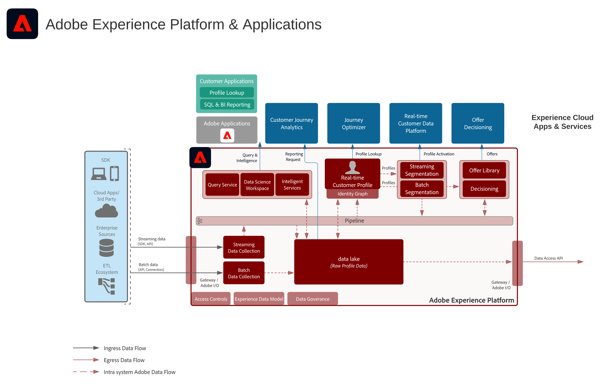

# 利用數位體驗藍圖實現行業成功

瞭解客戶如何透過數位體驗藍圖打造絕佳體驗並取得成功。 這些經驗證的可重複實施使您能夠解決策略問題並快速解決既定的業務問題。

## 精選成功案例

<table style="table-layout:fixed">
<tr>
  <td>
    
    </td>
  <td>
    

</td>
  <td>
    
  </td>
  <td>
    
  </td>
</tr>
<tr>
  <td>
    
<a href="https://experienceleague.adobe.com/docs/blueprints-learn/architecture/vertical-blueprints/apparel.html?lang=zh-Hant"><strong>服裝業</strong></a>

    
<em>即時行銷、跨通道啟用和跨管道分析。</em>

  </td>
  <td>
    
<a href="https://experienceleague.adobe.com/docs/blueprints-learn/architecture/vertical-blueprints/retail.html?lang=zh-Hant"><strong>零售業</strong></a>

    
<em>數位媒體、電子郵件、推播和網頁通道上的即時客戶體驗。</em>

  </td>
  <td>
    
<a href="https://experienceleague.adobe.com/docs/blueprints-learn/architecture/vertical-blueprints/telecommunications.html?lang=zh-Hant"><strong>電信業</strong></a>

    
<em>即時量身打造交易，同時讓客戶高效登入，帶來長期忠誠度。</em>

  </td>
  <td>
    
<a href="https://experienceleague.adobe.com/docs/blueprints-learn/architecture/vertical-blueprints/travel-hospitality.html?lang=zh-Hant"><strong>旅行和酒店業</strong></a>

    
<em>以整合的檢視，即時決定各通道的客戶行為。</em>

  </td>
</tr>
</table>

## 更多成功案例

* <a href="https://business.adobe.com/customer-success-stories/index.html?Products+%26+Services=Experience">Adobe Experience Cloud</a>
* <a href="https://business.adobe.com/customer-success-stories/index.html?Products+%26+Services=Experience+Platform">Adobe Experience Platform</a>
* <a href="https://business.adobe.com/customer-success-stories/index.html?Products+%26+Services=Intelligent+Services">Adobe Intelligent Services</a>
