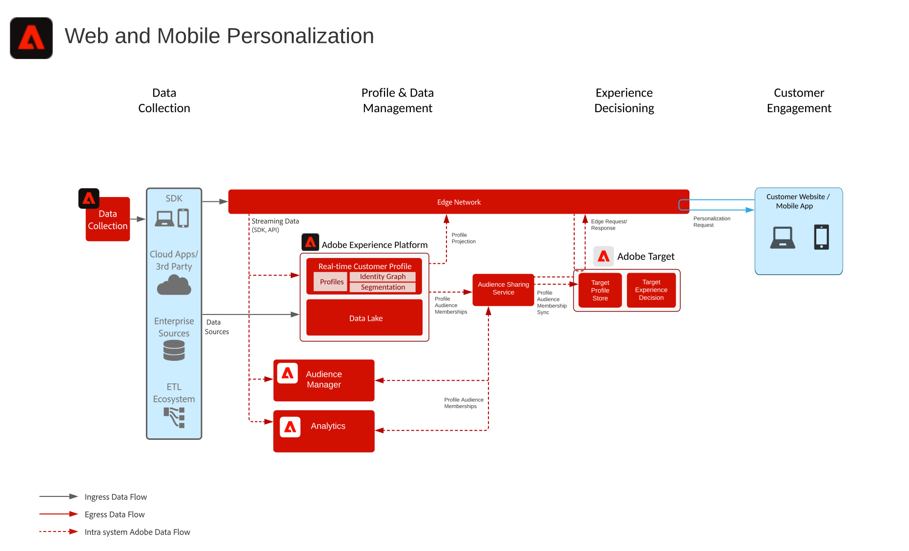

# 行為網頁/行動個人化藍圖

基於線上行為及對象資料進行個人化。

## 使用案例

* 登陸頁面最佳化
* 行為目標定位
* 基於先前產品 / 內容視圖、產品 / 內容相似性、環境屬性、協力廠商受眾資料及人口統計資料的個人化

## 應用程式

* Adobe Target
* Adobe Analytics (可選)
* Adobe Audience Manager (可選)
* Adobe Real-time Customer Data Platform（可選）

## 架構

## 實作模式

網路/行動個人化 Blueprint 可透過下列方法實施，如下所述。

1. 使用 [!UICONTROL Platform Web SDK] 或 [!UICONTROL Platform Mobile SDK] 及 [!UICONTROL Edge Network]。[請參閱 Experience Platform Web 和 Mobile SDK Blueprint](../experience-platform/deployment/websdk.md)
1. 使用傳統應用程式特定的 SDK (例如 AppMeasurement.js). [請參閱應用程式專屬的SDK Blueprint](../experience-platform/deployment/appsdk.md)

## 實作步驟

1. 對您的網路或行動應用程式[實施 Adobe Target](https://experienceleague.adobe.com/docs/target/using/implement-target/implementing-target.html?lang=zh-Hant)。

### 實作步驟 — Audience Manager或Adobe Analytics

1. [實施 Adobe Audience Manager](https://experienceleague.adobe.com/docs/audience-manager/user-guide/implementation-integration-guides/implement-audience-manager.html?lang=zh-Hant)
1. [實施 Adobe Analytics](https://experienceleague.adobe.com/docs/analytics/implementation/home.html?lang=zh-Hant)
1. [實施 Experience Cloud Identity 服務](https://experienceleague.adobe.com/docs/id-service/using/implementation/implementation-guides.html?lang=zh-Hant)

   >[!NOTE]
   >
   >每個應用程式必須使用 Experience Cloud ID 且屬於同一 Experience Cloud Org，才允許在應用程式之間進行對象分享。

1. [請求佈建人員與對象分享服務 (已分享對象)](https://www.adobe.com/go/audiences)
1. 在 [Adobe Analytics](https://experienceleague.adobe.com/docs/analytics/components/segmentation/segmentation-workflow/seg-build.html?lang=zh-Hant) 或 [Adobe Audience Manager](https://experienceleague.adobe.com/docs/audience-manager/user-guide/features/segments/segment-builder.html?lang=zh-Hant) 中建置區段，並[設定這些對象分享到 Experience Cloud](https://experienceleague.adobe.com/docs/analytics/components/segmentation/segmentation-workflow/seg-publish.html?lang=zh-Hant) (若使用 Audience Manager 或 Adobe Analytics)
1. 一旦可在 Adobe Target 中使用對象後，便可將之用於[使用 Adobe Target 的目標定位體驗](https://experienceleague.adobe.com/docs/target/using/audiences/target.html?lang=zh-Hant)

### 實作步驟 — Real-time Customer Data Platform

1. 為要擷取的資料[建立資料方案](https://experienceleague.adobe.com/?recommended=ExperiencePlatform-D-1-2021.1.xdm)。
1. 為要擷取的資料[建立資料集](https://experienceleague.adobe.com/docs/platform-learn/tutorials/data-ingestion/create-datasets-and-ingest-data.html?lang=zh-Hant)。
1. [在方案上設定正確的身份和身份命名空間](https://experienceleague.adobe.com/docs/platform-learn/tutorials/identities/label-ingest-and-verify-identity-data.html?lang=zh-Hant)，以確保擷取的資料可以嵌入統一的個人資料。
1. [為個人資料啟用方案和資料集](https://experienceleague.adobe.com/docs/platform-learn/tutorials/profiles/bring-data-into-the-real-time-customer-profile.html?lang=zh-Hant)。
1. [擷取資料](https://experienceleague.adobe.com/?recommended=ExperiencePlatform-D-1-2020.1.dataingestion&amp;lang=zh-Hant)到 Experience Platform。
1. [在 Experience Platform 與 Audience Manager 之間為 Experience Platform 中定義要分享至 Audience Manager 的對象佈建[!UICONTROL 即時客戶資料平台]區段分享。](https://www.adobe.com/go/audiences)
1. 在 Experience Platform 中[建立區段](https://experienceleague.adobe.com/docs/platform-learn/tutorials/segments/create-segments.html?lang=zh-Hant)。系統會自動確定區段是作為批次還是串流評估。
1. 將用於個人資料屬性和對象會籍分享的目標[設定為所需的目標。](https://experienceleague.adobe.com/docs/platform-learn/tutorials/destinations/create-destinations-and-activate-data.html?lang=zh-Hant)

## 相關檔案

* [Experience Cloud 受眾](https://experienceleague.adobe.com/docs/core-services/interface/audiences/audience-library.html?lang=zh-Hant)
* [整合 Audience Manager 與 Adobe Target](https://experienceleague.adobe.com/docs/audience-manager/user-guide/implementation-integration-guides/integration-other-solutions/aam-target-integration.html?lang=zh-Hant)
* [透過 Adobe Audience Manager 分享 Adobe Analytics 區段](https://experienceleague.adobe.com/docs/analytics/components/segmentation/segmentation-workflow/seg-publish.html?lang=zh-Hant)
* [[!UICONTROL 即時客戶資料平台]概覽](https://experienceleague.adobe.com/docs/platform-learn/tutorials/application-services/rtcdp/understanding-the-real-time-customer-data-platform.html?lang=zh-Hant)
* [[!UICONTROL 即時客戶資料平台]產品說明](https://helpx.adobe.com/tw/legal/product-descriptions/real-time-customer-data-platform.html)
* [個人資料與細分準則](https://experienceleague.adobe.com/docs/experience-platform/profile/guardrails.html?lang=zh-Hant)
* [細分文件](https://experienceleague.adobe.com/docs/experience-platform/segmentation/api/streaming-segmentation.html?lang=zh-Hant)
* [目標文件](https://experienceleague.adobe.com/docs/experience-platform/destinations/catalog/overview.html?lang=zh-Hant)

## 相關部落格貼文

* [[!DNL Blueprint for Web Personalization using Adobe Experience Platform Real-Time Customer Profile]](https://medium.com/adobetech/blueprint-for-web-personalization-using-adobe-experience-platform-real-time-customer-profile-fef2ce7a4b2f)
* [[!DNL Integrating Adobe Experience Platform Decisioning Engine with AEM Websites]](https://jaeness.medium.com/integrating-adobe-experience-platform-decisioning-engine-with-aem-websites-9c222acd12e2)
* [[!DNL Adobe Experience Platform Web SDK for Audience Management]](https://medium.com/adobetech/adobe-experience-platform-web-sdk-for-audience-management-751fa6d063bc)
* [[!DNL Implementing Adobe Experience Platform Real-Time Customer Profile through our "Customer Zero" Program]](https://medium.com/adobetech/implementing-adobe-experience-platform-real-time-customer-profile-through-our-customer-zero-32e7cd952896)
* [[!DNL How Adobe Experience Platform Can Help Customers Personalize Their Mobile Messaging in Real-Time with Journey Orchestration Service and a Mobile Messaging Vendor]](https://medium.com/adobetech/how-adobe-experience-platform-helped-a-client-personalize-their-mobile-messaging-in-real-time-with-7d634aefa098)
* [[!DNL Segmentation in Seconds: How Adobe Experience Platform Made Real-time Customer Profiles a Reality]](https://medium.com/adobetech/segmentation-in-seconds-how-adobe-experience-platform-made-real-time-customer-profiles-a-reality-a7a8552b0847)
