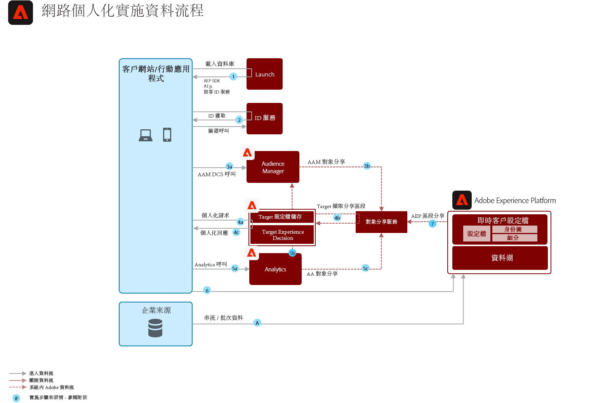

# 行為網頁個人化藍本

根據線上行為和受眾資料進行個人化。

## 使用案例

* 著陸頁面最佳化
* 行為定位
* 根據先前的產品／內容檢視、產品／內容親和力、環境屬性、協力廠商受眾資料和人口統計資料進行個人化

## 應用程式

* Adobe Target
* Adobe Analytics（可選）
* Adobe Audience Manager（可選）

## 建築

## 瓜德賴爾

依預設，區段共用服務允許每個Adobe Analytics報表套裝共用最多75個對象。 如果Audience Manager用於觀眾共用，則可共用的觀眾數目沒有限制。 

## 實施先決條件

| 應用程式／服務 | 必要的程式庫 | 附註 |
|---|---|---|
| Adobe Target | 平台網頁SDK*、at.js 0.9.1+或mbox.js 61+ | at.js是偏好的，因為mbox.js不再開發。 |
| Adobe Audience Manager（選用） | Platform Web SDK*或dil.js 5.0+ |  |
| Adobe Analytics（選用） | 平台網頁SDK*或AppMeasurement.js 1.6.4+ |  |
| Experience Cloud身分服務 | 平台網頁SDK*或VisitorAPI.js 2.0+ |  |
| Experience Platform行動SDK（選用） | iOS和Android™適用的4.11或更新版本 |  |
| Experience Platform網頁SDK | 1.0，目前的Experience PlatformSDK版本有[Experience Cloud應用程式尚未支援的各種使用案例](https://github.com/adobe/alloy/projects/5) |  |

## 實施步驟

1. [為您的網](https://experienceleague.adobe.com/docs/target/using/implement-target/implementing-target.html) 頁或行動應用程式實作Adobe定位。

   如果使用Audience Manger或Analytics:

1. [實施Adobe Audience Manager](https://experienceleague.adobe.com/docs/audience-manager/user-guide/implementation-integration-guides/implement-audience-manager.html)
1. [實施Adobe Analytics](https://experienceleague.adobe.com/docs/analytics/implementation/home.html)
1. [實作Experience Cloud身分服務](https://experienceleague.adobe.com/docs/id-service/using/implementation/implementation-guides.html)

   >[!NOTE]
   >
   >每個應用程式都必須使用Experience CloudID，並且是同一Experience Cloud組織的一部分，才能允許應用程式之間的觀眾共用。

1. [請求人員與觀眾共用服務的布建(Shared Audiences)](https://www.adobe.com/go/audiences)
1. 在[Adobe Analytics](https://experienceleague.adobe.com/docs/analytics/components/segmentation/segmentation-workflow/seg-build.html)或[Adobe Audience Manager](https://experienceleague.adobe.com/docs/audience-manager/user-guide/features/segments/segment-builder.html)和[中建立區段，以設定這些觀眾以分享至Experience Cloud](https://experienceleague.adobe.com/docs/analytics/components/segmentation/segmentation-workflow/seg-publish.html)(如果使用Audience Manager或Adobe Analytics)
1. 在Adobe Target提供受眾後，就可用於Adobe Target的[定位體驗](https://experienceleague.adobe.com/docs/target/using/audiences/target.html)

## 實施資料流圖

「網頁／行動個人化藍圖」可透過使用平台網頁SDK或行動SDK和Edge網路，或使用傳統應用程式專用的SDK（例如AppMeasurement.js）來實作。

### 平台網頁／行動SDK與Edge網路方法

### 應用程式專用的SDK方法

## 相關檔案

* [Experience Cloud觀眾](https://experienceleague.adobe.com/docs/core-services/interface/audiences/audience-library.html)
* [將Audience Manager與Adobe Target整合](https://experienceleague.adobe.com/docs/audience-manager/user-guide/implementation-integration-guides/integration-other-solutions/aam-target-integration.html)
* [Adobe Analytics區段分享透AAM過](https://experienceleague.adobe.com/docs/analytics/components/segmentation/segmentation-workflow/seg-publish.html)

## 相關部落格文章

* [使用Adobe Experience Platform即時客戶個人檔案的網路個人化藍圖](https://medium.com/adobetech/blueprint-for-web-personalization-using-adobe-experience-platform-real-time-customer-profile-fef2ce7a4b2f)
* [整合Adobe Experience Platform決策引擎與網AEM站](https://jaeness.medium.com/integrating-adobe-experience-platform-decisioning-engine-with-aem-websites-9c222acd12e2)
* [Adobe Experience Platform預測性受眾如何改善個人化體驗](https://medium.com/adobetech/how-adobe-experience-platform-predictive-audiences-improves-personalized-experiences-1f75a60cb7a3)
* [Adobe Experience PlatformWeb SDK的觀眾管理](https://medium.com/adobetech/adobe-experience-platform-web-sdk-for-audience-management-751fa6d063bc)
* [通過我們的「客戶零」計畫實施Adobe Experience Platform即時客戶概要資訊](https://medium.com/adobetech/implementing-adobe-experience-platform-real-time-customer-profile-through-our-customer-zero-32e7cd952896)
* [Adobe Experience Platform公司如何通過Journey Orchestration服務和移動消息服務供應商幫助客戶即時個性化其移動消息服務](https://medium.com/adobetech/how-adobe-experience-platform-helped-a-client-personalize-their-mobile-messaging-in-real-time-with-7d634aefa098)
* [數秒即可劃分：Adobe Experience Platform如何讓即時客戶個人檔案成為現實](https://medium.com/adobetech/segmentation-in-seconds-how-adobe-experience-platform-made-real-time-customer-profiles-a-reality-a7a8552b0847)