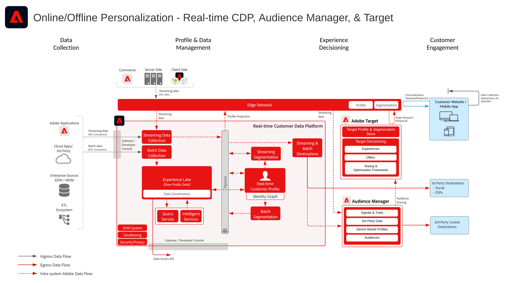

# 使用已知客戶資料Blueprint的網頁/行動個人化

## 使用案例

* 使用已知客戶資料進行線上個人化
* 登陸頁面最佳化
* 除了離線資料（例如交易、忠誠度和CRM資料）以及模型化的深入分析外，還根據先前的產品/內容檢視、產品/內容相關性、環境屬性和人口統計資料進行個人化
* 在使用Adobe Target的網站和行動應用程式上共用和鎖定Real-time Customer Data Platform中定義的對象。

## 應用程式

* [!UICONTROL Real-time Customer Data Platform]
* Adobe Target
* Adobe Audience Manager（可選）:新增第三方受眾資料
* Adobe Analytics或Customer Journey Analytics（可選）:新增根據歷史客戶和行為資料建立區段並執行微調細分的功能

## 整合模式

| 整合模式 | 功能 | 先決條件 |
|---|---|---|
| 對從Real-time Customer Data Platform共用至Target的Edge進行即時區段評估 | <ul><li>在Edge上即時評估相同或下一頁個人化的對象。</li><li>此外，以串流或批次方式評估的任何區段也會投影至邊緣網路，以納入邊緣區段評估和個人化中。</li></ul> | <ul><li>必須實作Web/Mobile SDK，或使用邊緣網路伺服器API</li><li>必須在Experience Edge中設定資料流，並啟用Target和Experience Platform擴充功能</li><li>Target目的地必須在Real-time Customer Data Platform目的地中設定。</li><li>與Target整合需要與Experience Platform例項相同的IMS組織。</li></ul> |
| 透過Edge方法將受眾從Real-time Customer Data Platform串流和批次共用至Target | <ul><li>透過邊緣網路將串流和批次對象從Real-time Customer Data Platform共用至Target。 即時評估的對象需要Web SDK和邊緣網路實作。</li></ul> | <ul><li>將串流和批次RTCDP對象共用至Target時，不需要Target的Web/Mobile SDK或Edge API實作，不過需要進行上述的即時邊緣區段評估。</li><li>如果使用AT.js，則僅支援針對ECID身分命名空間的設定檔整合。</li><li>在Edge上進行自訂身分命名空間查閱時，需要部署Web SDK/Edge API，且每個身分都必須在身分對應中設定為身分。</li><li>Target目的地必須在Real-time Customer Data Platform目的地中設定，僅支援RTCDP中的預設生產沙箱。</li><li>與Target整合需要與Experience Platform例項相同的IMS組織。</li></ul> |
| 透過受眾共用服務方法，從Real-time Customer Data Platform串流和批次共用受眾至Target和Audience Manager | <ul><li>當需要從第三方資料和Audience Manager中的對象進行額外擴充時，可運用此整合模式。</li></ul> | <ul><li>將串流和批次對象共用至Target並不需要Web/Mobile SDK，不過需要Web/Mobile SDK才能進行即時邊緣區段評估。</li><li>如果使用AT.js，則僅支援針對ECID身分命名空間的設定檔整合。</li><li>在Edge上進行自訂身分命名空間查閱時，需要部署Web SDK/Edge API，且每個身分都必須在身分對應中設定為身分。</li><li>必須透過受眾共用服務布建受眾投影。</li><li>與Target整合需要與Experience Platform例項相同的IMS組織。</li><li>只有來自預設生產沙箱的對象才支援對象共用核心服務。</li></ul> |

## 將即時、串流和批次受眾分享至Adobe Target

架構

序列詳細資訊

概述架構

## 實作模式

已知客戶個人化透過數種實作方法受支援。

### 實作模式1 — 使用Web/Mobile SDK或邊緣網路API的邊緣網路（建議方法）

* 搭配Web/Mobile SDK使用邊緣網路。 即時邊緣分段需要Web/Mobile SDK或Edge API實作方法。
* [請參閱Experience Platform網頁和行動SDK Blueprint](../experience-platform/deployment/websdk.md) 以SDK為基礎的實作。
* 若要用於行動SDK，請 [Adobe Journey Optimizer — 決策擴充功能](https://aep-sdks.gitbook.io/docs/using-mobile-extensions/adobe-journey-optimizer-decisioning) 必須安裝在行動SDK中。
* [請參閱邊緣網路伺服器API](https://experienceleague.adobe.com/docs/experience-platform/edge-network-server-api/overview.html) 以API為基礎，實作具有邊緣設定檔的Adobe Target。

### 實作模式2 — 應用程式專用SDK

使用傳統應用程式專用的SDK（例如AT.js和AppMeasurement.js）。 此實作方法不支援即時邊緣區段評估。 不過，使用此實作方法，可支援從Experience Platform中心串流和批次分享受眾。

[請參閱應用程式專屬的SDK Blueprint](../experience-platform/deployment/appsdk.md)

### 實作步驟

1. 對您的網路或行動應用程式[實施 Adobe Target](https://experienceleague.adobe.com/docs/target/using/implement-target/implementing-target.html?lang=zh-Hant)
1. [實作Experience Platform和 [!UICONTROL 即時客戶個人檔案]](https://experienceleague.adobe.com/docs/platform-learn/getting-started-for-data-architects-and-data-engineers/overview.html?lang=zh-Hant) 透過設定適用的 [合併策略](https://experienceleague.adobe.com/docs/experience-platform/profile/merge-policies/ui-guide.html?lang=en#create-a-merge-policy) 在邊緣上處於活動狀態。
1. 實作 [Experience PlatformWeb SDK](https://experienceleague.adobe.com/docs/experience-platform/edge/home.html?lang=zh-Hant) 或 [Experience Platform行動SDK](https://aep-sdks.gitbook.io/docs/) 並安裝正確的擴充功能(Target或Adobe Journey Optimizer - Decisioning)。 Experience PlatformWeb/Mobile SDK或EDGE API是即時Edge細分的必要項目，但從Real-time Customer Data Platform到Target共用串流和批次受眾則並非必要項目。
1. [使用邊緣資料流配置邊緣網路](https://experienceleague.adobe.com/docs/experience-platform/edge/fundamentals/datastreams.html)
1. [啟用Adobe Target作為Real-time Customer Data Platform內的目的地](https://experienceleague.adobe.com/docs/experience-platform/destinations/catalog/personalization/adobe-target-connection.html?lang=en)
1. （可選） [實作Adobe Audience Manager](https://experienceleague.adobe.com/docs/audience-manager/user-guide/implementation-integration-guides/implement-audience-manager.html?lang=zh-Hant).
1. （可選） [請求布建以在Experience Platform和Adobe Target之間共用受眾（共用受眾）](https://www.adobe.com/go/audiences) 從Experience Platform共用對象至Target。

## 護欄

[請參閱「網路與行動個人化 Blueprints」概觀頁面所述的護欄。](overview.md)

* 邊緣設定檔僅會在使用者於邊緣處於作用中狀態時建立，亦即其設定檔會透過Web/Mobile SDK或邊緣伺服器API將串流事件提交至邊緣。 這通常對應於在網站或行動應用程式上處於作用中狀態的使用者。
* 邊緣設定檔的預設存留時間為14天。 如果使用者尚未收集使用中的邊緣事件，則設定檔閒置14天後會在邊緣過期。 設定檔在集線器中將保持有效，並且當使用者再次在邊緣上變為活動狀態時，會與邊緣同步。
* 在邊緣上建立新的設定檔時，會非同步呼叫中樞，以擷取已透過目的地為邊緣投影設定的任何對象和屬性。 由於這是非同步程式，集線器配置檔案可能需要1秒到數分鐘的時間才能同步到邊緣。 因此，無法保證新設定檔具有來自第一頁體驗中樞的設定檔內容。 這同樣適用於新收集的資料到中樞。 此資料會以非同步方式投影至邊緣，因此資料到達適當邊緣的時間會與邊緣活動分開。 只有邊緣上作用中的設定檔才會保留從中樞投影的屬性和對象。

## 實作考量事項

身分先決條件

* 透過Edge網路和Web SDK使用上述實作模式1時，可運用任何主要身分。 首次登入個人化需要個人化請求設定的主要身分，與Real-time Customer Data Platform中設定檔的主要身分相符。 匿名裝置與已知客戶之間的身分識別拼接會在中樞進行處理，然後投影至邊緣。
* 請注意，消費者造訪或登入網站之前上傳至中心的資料，將無法立即供個人化使用。 中心資料必須先有作用中的邊緣設定檔，才能同步至。 建立後，邊緣設定檔會以非同步方式與中樞設定檔同步，進而產生下一頁個人化。
* 從Adobe Experience Platform共用受眾至Adobe Target時，若要使用上述整合模式2和3所述的受眾共用服務，必須以ECID作為身分。
* 替代身分也可用來透過Audience Manager與Adobe Target共用Experience Platform對象。 Experience Platform會透過下列支援的命名空間啟用對象以Audience Manager:IDFA、GAID、AdCloud、Google、ECID、EMAIL_LC_SHA256。 請注意，Audience Manager和Target會透過ECID身分識別解析受眾成員資格，因此消費者在身分圖中仍需要有ECID，才能最終分享至Adobe Target。

## 相關檔案

### SDK檔案

* [Experience Platform Web SDK 文件](https://experienceleague.adobe.com/docs/experience-platform/edge/home.html?lang=zh-Hant)
* [Experience Platform標籤檔案](https://experienceleague.adobe.com/docs/experience-platform/tags/home.html)
* [Experience Cloud ID 服務文件](https://experienceleague.adobe.com/docs/id-service/using/home.html?lang=zh-Hant)

### 連線檔案

* [Adobe Target Connection for Real-time Customer Data Platform](https://experienceleague.adobe.com/docs/experience-platform/destinations/catalog/personalization/adobe-target-connection.html?lang=en)
* [邊緣資料流配置](https://experienceleague.adobe.com/docs/experience-platform/edge/fundamentals/datastreams.html)
* [使用 Audience Manager 及其他 Experience Cloud 解決方案的 Experience Platform 區段分享](https://experienceleague.adobe.com/docs/audience-manager/user-guide/implementation-integration-guides/integration-experience-platform/aam-aep-audience-sharing.html?lang=zh-Hant)

### 細分文件

* [Experience Platform 細分概覽](https://experienceleague.adobe.com/docs/experience-platform/segmentation/home.html?lang=zh-Hant)
* [即時細分](https://experienceleague.adobe.com/docs/experience-platform/segmentation/ui/edge-segmentation.html)
* [串流細分](https://experienceleague.adobe.com/docs/experience-platform/segmentation/api/streaming-segmentation.html?lang=zh-Hant)
* [透過 Adobe Audience Manager 分享 Adobe Analytics 區段](https://experienceleague.adobe.com/docs/analytics/components/segmentation/segmentation-workflow/seg-publish.html?lang=zh-Hant)
* [合併策略配置](https://experienceleague.adobe.com/docs/experience-platform/profile/merge-policies/ui-guide.html?lang=en#create-a-merge-policy)

### 教學課程

* [使用Real-Time CDP和Adobe Target進行下次點擊個人化](https://experienceleague.adobe.com/docs/platform-learn/tutorials/experience-cloud/next-hit-personalization.html?lang=en)

### 相關部落格貼文

* [Adobe宣佈使用Adobe Target和Real-time Customer Data Platform實現相同頁面增強個人化](https://blog.adobe.com/en/publish/2021/10/05/adobe-announces-same-page-enhanced-personalization-with-adobe-target-real-time-customer-data-platform)
* [[!DNL Blueprint for Web Personalization using Adobe Experience Platform Real-Time Customer Profile]](https://medium.com/adobetech/blueprint-for-web-personalization-using-adobe-experience-platform-real-time-customer-profile-fef2ce7a4b2f)
* [[!DNL Adobe Experience Platform's Identity Service — How to Solve the Customer Identity Conundrum]](https://medium.com/adobetech/adobe-experience-platforms-identity-service-how-to-solve-the-customer-identity-conundrum-f95e22d16ea9)
* [[!DNL Adobe Experience Platform Web SDK for Audience Management]](https://medium.com/adobetech/adobe-experience-platform-web-sdk-for-audience-management-751fa6d063bc)
* [[!DNL Implementing Adobe Experience Platform Real-Time Customer Profile through our "Customer Zero" Program]](https://medium.com/adobetech/implementing-adobe-experience-platform-real-time-customer-profile-through-our-customer-zero-32e7cd952896)
* [[!DNL Segmentation in Seconds: How Adobe Experience Platform Made Real-time Customer Profiles a Reality]](https://medium.com/adobetech/segmentation-in-seconds-how-adobe-experience-platform-made-real-time-customer-profiles-a-reality-a7a8552b0847)
