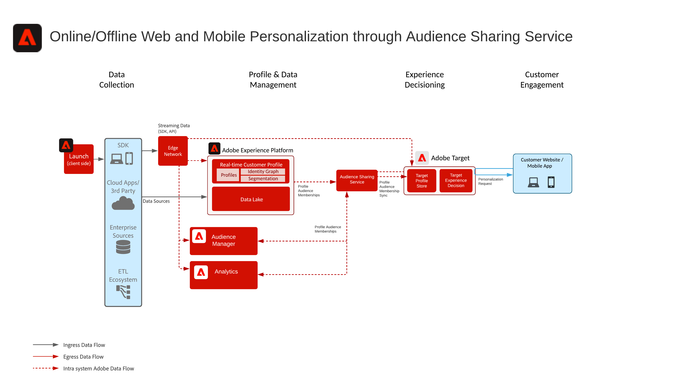

# Web/Mobile個性化，包括線上和離線資料

## 使用案例

* 使用線上和離線資料以及已知配置檔案進行線上個性化
* 登陸頁面最佳化
* Personalization基於先前的產品/內容視圖、產品/內容親和性、環境屬性和人口結構，以及離線資料（如交易、忠誠度和CRM資料），以及模型化的洞察
* 在使用Adobe Target的網站和移動應用上分享和瞄準Real-time Customer Data Platform定義的受眾。

## 應用程式

* [!UICONTROL 即時客戶資料平台]
* Adobe Target
* Adobe Audience Manager（可選）:增加第三方觀眾資料、基於合作的設備圖表、在Adobe Analytics面對Real-time Customer Data Platform觀眾的能力，以及在Real-time Customer Data Platform面對Adobe Analytics觀眾的能力
* Adobe Analytics (可選)：新增基於歷史行為資料以及 Adobe Analytics 資料的細分建立區段的能力

## 使用案例方案

<table class="tg" style="undefined;table-layout: fixed; width: 790px">
<colgroup>
<col style="width: 20px">
<col style="width: 276px">
<col style="width: 229px">
<col style="width: 265px">
</colgroup>
<thead>
  <tr>
    <th class="tg-y6fn">#</th>
    <th class="tg-f7v4">使用案例方案</th>
    <th class="tg-y6fn">功能</th>
    <th class="tg-f7v4">先決條件</th>
  </tr>
</thead>
<tbody>
  <tr>
    <td class="tg-0lax">1</td>
<td class="tg-73oq">對從Real-time Customer Data Platform到目標共用的邊緣進行即時段評估</td>
    <td class="tg-0lax"> — 即時評估受眾，以便在邊緣上實現相同或下一頁個性化。  — 此外，任何以流式處理或批處理方式評估的網段也將投影到邊緣網路，以納入邊緣網段評估和個性化。</td>
    <td class="tg-73oq"> — 實施模式1，詳見下文。  — 必須實施Web/Mobile SDK。  — 請注意，當前不提供基於移動SDK和API的即時分段支援  — 必須在「體驗邊緣」中配置資料流，並啟用「目標」和「Experience Platform」擴展，「目標」目標配置中將提供資料流ID。  — 必須在Real-time Customer Data Platform目標中配置目標目標。  — 與目標整合需要與Experience Platform實例相同的IMS組織。</td> 
  </tr>
  <tr>
    <td class="tg-0lax">2</td>
    <td class="tg-73oq">通過Edge方法從Real-time Customer Data Platform到Target流媒體和批量訪問群共用</td>
    <td class="tg-0lax"> — 通過邊緣網路將流媒體和批量觀眾從Real-time Customer Data Platform共用到目標。 即時評估的受眾需要WebSDK和整合模式1中概述的即時受眾評估。  — 此整合通常用於使用傳統SDK共用流和批訪問群體，而不是遷移到Edge Collection和WebSDK，後者可支援即時、流和批訪問群體，如整合方案1中所述。</td>
    <td class="tg-73oq"> — 實施模式1或2，詳見下文。 - Web/MobileSDK不需要將流和批訪問群共用到目標，但需要啟用即時邊緣段評估，如整合模式1中所述。   — 如果使用AT.js，則只支援針對ECID標識命名空間的配置檔案整合。   — 對於邊緣上的自定義標識名稱空間查找，需要WebSDK部署，並且必須在標識映射中將每個標識設定為標識。  — 必須在體驗邊緣中配置Datastream,Datastream ID將在目標目標配置中提供。  — 必須在Real-time Customer Data Platform目標中配置目標目標。  — 與目標整合需要與Experience Platform實例相同的IMS組織。</td>
  </tr>
  <tr>
    <td class="tg-0lax">3</td>
    <td class="tg-73oq">通過受眾共用服務方式從Real-time Customer Data Platform到目標和Audience Manager的流式和批量受眾共用</td>
    <td class="tg-0lax"> — 通過觀眾共用服務將流媒體和批量觀眾從Real-time Customer Data Platform分到目標和Audience Manager。   — 當希望從第三方資料和Audience Manager受眾獲得更多資訊時，可以利用這種整合模式。 否則優選整合模式1和2。 即時評估的受眾需要WebSDK和整合模式1中概述的即時受眾評估。</td>
    <td class="tg-73oq"> — 實施模式1或2，詳見下文。  — 此整合不需要Web/Mobile SDK部署。  — 必須通過觀眾共用服務提供觀眾投影。  — 與目標整合需要與Experience Platform實例相同的IMS組織。  — 必須將標識解析為ECID，以便共用到邊緣，以便Target在上執行操作。</td>
  </tr>
</tbody>
</table>

## 方案1和方案2 — 即時、流式和批量訪問群共用到Adobe Target

架構

序列詳細資訊

用例方案1和2的概述體系結構

### 用例方案1的實施步驟，也支援用例方案2

1. 對您的網路或行動應用程式[實施 Adobe Target](https://experienceleague.adobe.com/docs/target/using/implement-target/implementing-target.html?lang=zh-Hant)
1. [實施Experience Platform和 [!UICONTROL 即時客戶概要資訊]](https://experienceleague.adobe.com/docs/platform-learn/getting-started-for-data-architects-and-data-engineers/overview.html?lang=zh-Hant) 通過配置適用的 [合併策略](https://experienceleague.adobe.com/docs/experience-platform/profile/merge-policies/ui-guide.html?lang=en#create-a-merge-policy) 在邊上處於活動狀態。
1. 實施 [Experience PlatformWeb SDK](https://experienceleague.adobe.com/docs/experience-platform/edge/home.html?lang=zh-Hant)。 Experience PlatformWeb SDK是即時邊緣分割的必需工具，但是從Real-time Customer Data Platform到目標共用流和批訪問群集則不是必需的。 請注意，目前不支援通過Mobile SDK和API進行即時分段。
1. [使用邊緣資料流配置邊緣網路](https://experienceleague.adobe.com/docs/experience-platform/edge/fundamentals/datastreams.html)
1. [使Adobe Target成為Real-time Customer Data Platform內的目的地](https://experienceleague.adobe.com/docs/experience-platform/destinations/catalog/personalization/adobe-target-connection.html?lang=en)

 

## 方案3 — 通過向Adobe Target和Audience Manager提供受眾共用服務進行流式和批式受眾共用

架構

### 方案3的實施步驟，也支援方案2

1. 對您的網路或行動應用程式[實施 Adobe Target](https://experienceleague.adobe.com/docs/target/using/implement-target/implementing-target.html)
1. [實施 Adobe Audience Manager](https://experienceleague.adobe.com/docs/audience-manager/user-guide/implementation-integration-guides/implement-audience-manager.html?lang=zh-Hant) (可選)
1. [實施 Adobe Analytics](https://experienceleague.adobe.com/docs/analytics/implementation/home.html?lang=zh-Hant) (可選)
1. [實施 Experience Platform 與[!UICONTROL 即時客戶個人資料]](https://experienceleague.adobe.com/docs/platform-learn/getting-started-for-data-architects-and-data-engineers/overview.html)
1. 實施 [Experience Cloud身份服務](https://experienceleague.adobe.com/docs/id-service/using/implementation/implementation-guides.html?lang=zh-Hant)
1. [請求設定Experience Platform與Adobe Target（共用受眾）之間的受眾共用](https://www.adobe.com/go/audiences) 共用從Experience Platform到目標的受眾。
1. （可選） [使用邊緣資料流配置邊緣網路](https://experienceleague.adobe.com/docs/experience-platform/edge/fundamentals/datastreams.html) (這僅是整合模式2所必需的，在這種模式下，不需要將受眾分享給Audience Manager或由Audience Manager受眾或資料豐富受眾)。
1. （可選） [使Adobe Target成為Real-time Customer Data Platform內的目的地](https://experienceleague.adobe.com/docs/experience-platform/destinations/catalog/personalization/adobe-target-connection.html?lang=en) 從Real-time Customer Data Platform直接到Edge與通過觀眾共用服務和Audience Manager共用流和批量觀眾。

 

## 實施模式

通過多種實現方法支援線上和離線個性化。

### 實施模式1 — 支援使用案例方案1和2。 帶Web/Mobile SDK的邊緣網路（推薦方法）

將邊緣網路與Web/Mobile SDK配合使用

序列圖

 

### 實施模式2 — 支援使用案例方案2和3。 應用程式特定的SDK

使用傳統的特定於應用程式的SDK（例如AT.js和AppMeasurement.js）

 

## 護欄

[請參閱「網路與行動個人化 Blueprints」概觀頁面所述的護欄。](overview.md)

## 實施考量

身份先決條件

* 在利用Edge網路和WebSDK中概述的實施模式1時，可以利用任何主身份。 首次登錄個性化要求個性化請求集主標識與來自Real-time Customer Data Platform的配置檔案的主標識匹配。 在集線器上處理匿名設備和已知客戶之間的身份拼接，然後投影到邊緣。
* 在使用上述用例方案3中概述的受眾共用服務時，要將ECID作為身份，就必須分享從Adobe Experience Platform到Adobe Target的受眾。
* 可以使用替代身份通過Audience Manager將Experience Platform觀眾分享給Adobe Target。 Experience Platform通過以下受支援的命名空間激活受眾以Audience Manager:IDFA、GAID、AdCloud、Google、ECID、EMAIL_LC_SHA256。 請注意，Audience Manager和目標通過ECID標識解析受眾成員身份，因此，最終與Adobe Target共用的受眾仍需要ECID。

## 相關文件

### SDK文檔

* [Experience Platform Web SDK 文件](https://experienceleague.adobe.com/docs/experience-platform/edge/home.html)
* [Experience Platform標籤文檔](https://experienceleague.adobe.com/docs/experience-platform/tags/home.html)
* [Experience Cloud ID 服務文件](https://experienceleague.adobe.com/docs/id-service/using/home.html?lang=zh-Hant)

### 連接文檔

* [Adobe TargetReal-time Customer Data Platform](https://experienceleague.adobe.com/docs/experience-platform/destinations/catalog/personalization/adobe-target-connection.html?lang=en)
* [邊緣資料流配置](https://experienceleague.adobe.com/docs/experience-platform/edge/fundamentals/datastreams.html)
* [使用 Audience Manager 及其他 Experience Cloud 解決方案的 Experience Platform 區段分享](https://experienceleague.adobe.com/docs/audience-manager/user-guide/implementation-integration-guides/integration-experience-platform/aam-aep-audience-sharing.html?lang=zh-Hant)

### 分段文檔

* [Experience Platform 細分概覽](https://experienceleague.adobe.com/docs/experience-platform/segmentation/home.html)
* [即時分割](https://experienceleague.adobe.com/docs/experience-platform/segmentation/ui/edge-segmentation.html)
* [串流細分](https://experienceleague.adobe.com/docs/experience-platform/segmentation/api/streaming-segmentation.html?lang=zh-Hant)
* [透過 Adobe Audience Manager 分享 Adobe Analytics 區段](https://experienceleague.adobe.com/docs/analytics/components/segmentation/segmentation-workflow/seg-publish.html?lang=zh-Hant)
* [合併策略配置](https://experienceleague.adobe.com/docs/experience-platform/profile/merge-policies/ui-guide.html?lang=en#create-a-merge-policy)

### 教學課程

* [通過即時CDP和Adobe Target實現下一次的個性化](https://experienceleague.adobe.com/docs/platform-learn/tutorials/experience-cloud/next-hit-personalization.html?lang=en)

### 相關部落格貼文

* [Adobe宣佈與Adobe Target和Real-time Customer Data Platform推出同一頁增強個性化](https://blog.adobe.com/en/publish/2021/10/05/adobe-announces-same-page-enhanced-personalization-with-adobe-target-real-time-customer-data-platform)
* [[!DNL Blueprint for Web Personalization using Adobe Experience Platform Real-Time Customer Profile]](https://medium.com/adobetech/blueprint-for-web-personalization-using-adobe-experience-platform-real-time-customer-profile-fef2ce7a4b2f)
* [[!DNL Adobe Experience Platform’s Identity Service — How to Solve the Customer Identity Conundrum]](https://medium.com/adobetech/adobe-experience-platforms-identity-service-how-to-solve-the-customer-identity-conundrum-f95e22d16ea9)
* [[!DNL Adobe Experience Platform Web SDK for Audience Management]](https://medium.com/adobetech/adobe-experience-platform-web-sdk-for-audience-management-751fa6d063bc)
* [[!DNL Implementing Adobe Experience Platform Real-Time Customer Profile through our “Customer Zero” Program]](https://medium.com/adobetech/implementing-adobe-experience-platform-real-time-customer-profile-through-our-customer-zero-32e7cd952896)
* [[!DNL Segmentation in Seconds: How Adobe Experience Platform Made Real-time Customer Profiles a Reality]](https://medium.com/adobetech/segmentation-in-seconds-how-adobe-experience-platform-made-real-time-customer-profiles-a-reality-a7a8552b0847)
