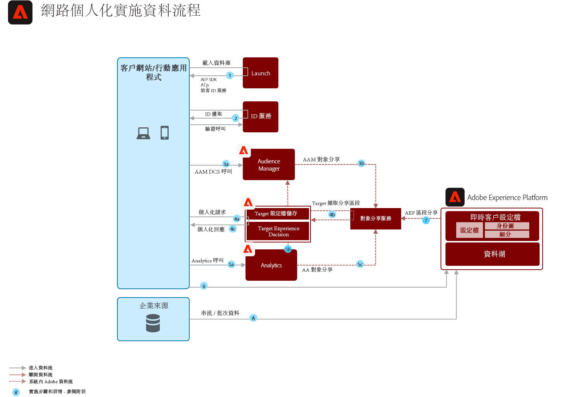

# Web/Mobile個性化，包括線上和離線資料

同步網路個人化與電子郵件及其他已知和匿名的通道個人化。

## 使用案例

* 登陸頁面最佳化
* 行為與離線個人資料目標定位
* 除離線深入見解 (如異動、忠誠度與 CRM 資料及建模的深入見解) 外，基於之前產品/內容視圖、產品/內容相似性、環境屬性、協力廠商對象資料及人口統計資料的個人化
* 在使用Adobe Target的網站和移動應用上分享和瞄準Real-time Customer Data Platform定義的受眾。

## 應用程式

* [!UICONTROL 即時客戶資料平台]
* Adobe Target
* Adobe Audience Manager（可選）:增加第三方觀眾資料、基於合作的設備圖表、在Adobe Analytics面對Real-time Customer Data Platform觀眾的能力，以及在Real-time Customer Data Platform面對Adobe Analytics觀眾的能力
* Adobe Analytics (可選)：新增基於歷史行為資料以及 Adobe Analytics 資料的細分建立區段的能力

## 整合模式

<table class="tg" style="undefined;table-layout: fixed; width: 790px">
<colgroup>
<col style="width: 20px">
<col style="width: 276px">
<col style="width: 229px">
<col style="width: 265px">
</colgroup>
<thead>
  <tr>
    <th class="tg-y6fn">#</th>
    <th class="tg-f7v4">整合模式</th>
    <th class="tg-y6fn">功能</th>
    <th class="tg-f7v4">先決條件</th>
  </tr>
</thead>
<tbody>
  <tr>
    <td class="tg-0lax">1</td>
<td class="tg-73oq">Real-time Customer Data Platform與目標共用邊緣上的即時段評估</td>
    <td class="tg-0lax"> — 即時評估受眾，以便在邊緣上實現相同或下一頁個性化。</td>
    <td class="tg-73oq"> — 必須在Real-time Customer Data Platform目標中配置目標目標。  — 與目標整合需要與Experience Platform實例相同的IMS組織。  — 必須實現WebSDK。  — 當前不提供基於移動SDK和API的實現</td> 
  </tr>
  <tr>
    <td class="tg-0lax">2</td>
    <td class="tg-73oq">Real-time Customer Data Platform通過Edge方法流式傳輸和批量訪問群共用到目標</td>
    <td class="tg-0lax"> — 通過邊緣網路將流媒體和批量觀眾從Real-time Customer Data Platform共用到目標。 即時評估的受眾需要WebSDK和整合模式1中概述的即時受眾評估。</td>
    <td class="tg-73oq"> — 必須在Real-time Customer Data Platform目標中配置目標目標。  — 與目標整合需要與Experience Platform實例相同的IMS組織。 不需要WebSDK。   — 如果僅使用AT.js，則支援對ECID的配置檔案查找。   — 對於邊緣上的自定義標識名稱空間查找，需要WebSDK部署，並且必須在標識映射中將每個標識設定為標識。</td>
  </tr>
  <tr>
    <td class="tg-0lax">3</td>
    <td class="tg-73oq">Real-time Customer Data Platform流和批量觀眾共用，通過觀眾共用服務方法實現目標和Audience Manager</td>
    <td class="tg-0lax"> — 通過觀眾共用服務將流媒體和批量觀眾從Real-time Customer Data Platform分到目標和Audience Manager。 即時評估的受眾需要WebSDK和整合模式1中概述的即時受眾評估。</td>
    <td class="tg-73oq"> — 必須通過觀眾共用服務提供觀眾投影。  — 與目標整合需要與Experience Platform實例相同的IMS組織。  — 必須將標識解析為ECID，以便共用到邊緣，以便Target在上執行操作。  — 此整合不需要WebSDK部署。</td>
  </tr>
</tbody>
</table>

## 架構

詳細體系結構

序列圖

 

概述體系結構

## 護欄

[請參閱「網路與行動個人化 Blueprints」概觀頁面所述的護欄。](overview.md)

## 實施模式

網路/行動個人化 Blueprint 可透過下列方法實施，如下所述。

1. 使用 [!UICONTROL Platform Web SDK] 或 [!UICONTROL Platform Mobile SDK] 及 [!UICONTROL Edge Network]。[請參閱 Experience Platform Web 和 Mobile SDK Blueprint](../data-ingestion/websdk.md)
1. 使用傳統應用程式特定的 SDK (例如 AppMeasurement.js)

## 實施考量

身份先決條件

* 在利用上面概述的與邊緣網路和WebSDK的整合模式1時，可以利用任何主身份。 首次登錄個性化要求個性化請求集主標識與來自Real-time Customer Data Platform的配置檔案的主標識匹配。 在集線器上處理匿名設備和已知客戶之間的身份拼接，然後投影到邊緣。 因此，如果將主標識設定為設備標識符，則在匿名和已知配置檔案已統一的後續會話之前，已知客戶資料將不會應用。
* 在使用上文整合模式3所概述的受眾共用服務時，分享從Adobe Experience Platform到Adobe Target的受眾需要將ECID作為身份。
* 可以使用替代身份通過Audience Manager將Experience Platform觀眾分享給Adobe Target。 Experience Platform通過以下受支援的命名空間激活受眾以Audience Manager:IDFA、GAID、AdCloud、Google、ECID、EMAIL_LC_SHA256。 請注意，Audience Manager和目標通過ECID標識解析受眾成員身份，因此，最終與Adobe Target共用的受眾仍需要ECID。

## 實施步驟

1. 對您的網路或行動應用程式[實施 Adobe Target](https://experienceleague.adobe.com/docs/target/using/implement-target/implementing-target.html?lang=zh-Hant)
1. [實施 Adobe Audience Manager](https://experienceleague.adobe.com/docs/audience-manager/user-guide/implementation-integration-guides/implement-audience-manager.html?lang=zh-Hant) (可選)
1. [實施 Adobe Analytics](https://experienceleague.adobe.com/docs/analytics/implementation/home.html?lang=zh-Hant) (可選)
1. [實施 Experience Platform 與[!UICONTROL 即時客戶個人資料]](https://experienceleague.adobe.com/docs/platform-learn/getting-started-for-data-architects-and-data-engineers/overview.html?lang=zh-Hant)
1. 實施 [Experience Cloud Identity 服務](https://experienceleague.adobe.com/docs/id-service/using/implementation/implementation-guides.html?lang=zh-Hant) 或 [Experience Platform Web SDK](https://experienceleague.adobe.com/docs/experience-platform/edge/home.html?lang=zh-Hant). Experience PlatformWeb SDK是即時邊緣分割的必需工具，但是從Real-time Customer Data Platform到目標共用流和批訪問群集則不是必需的。 請注意，目前不支援通過Mobile SDK和API進行即時分段。
1. [使Adobe Target成為Real-time Customer Data Platform內的目的地](https://experienceleague.adobe.com/docs/experience-platform/destinations/catalog/personalization/adobe-target-connection.html?lang=en) 或者為觀眾分享的方式 [請求設定Experience Platform與Adobe Target（共用受眾）之間的受眾共用](https://www.adobe.com/go/audiences) 共用從Experience Platform到目標的受眾。

## 相關文件

### 文件

* [Adobe TargetReal-time Customer Data Platform](https://experienceleague.adobe.com/docs/experience-platform/destinations/catalog/personalization/adobe-target-connection.html?lang=en)
* [使用 Audience Manager 及其他 Experience Cloud 解決方案的 Experience Platform 區段分享](https://experienceleague.adobe.com/docs/audience-manager/user-guide/implementation-integration-guides/integration-experience-platform/aam-aep-audience-sharing.html?lang=zh-Hant)
* [Experience Platform Web SDK 文件](https://experienceleague.adobe.com/docs/experience-platform/edge/home.html)
* [Experience Cloud ID 服務文件](https://experienceleague.adobe.com/docs/id-service/using/home.html?lang=zh-Hant)
* [Experience Platform 細分概覽](https://experienceleague.adobe.com/docs/experience-platform/segmentation/home.html?lang=zh-Hant)
* [串流細分](https://experienceleague.adobe.com/docs/experience-platform/segmentation/api/streaming-segmentation.html?lang=zh-Hant)
* [Experience Platform Segment Builder 概覽](https://experienceleague.adobe.com/docs/experience-platform/segmentation/ui/overview.html?lang=zh-Hant)
* [Audience Manager 來源連接器](https://experienceleague.adobe.com/docs/experience-platform/sources/connectors/adobe-applications/audience-manager.html?lang=zh-Hant)
* [透過 Adobe Audience Manager 分享 Adobe Analytics 區段](https://experienceleague.adobe.com/docs/analytics/components/segmentation/segmentation-workflow/seg-publish.html?lang=zh-Hant)
* [Experience Platform標籤文檔](https://experienceleague.adobe.com/docs/experience-platform/tags/home.html)

### 教學課程

* [通過即時CDP和Adobe Target實現下一次的個性化](https://experienceleague.adobe.com/docs/platform-learn/tutorials/experience-cloud/next-hit-personalization.html?lang=en)

## 相關部落格貼文

* [[!DNL Blueprint for Web Personalization using Adobe Experience Platform Real-Time Customer Profile]](https://medium.com/adobetech/blueprint-for-web-personalization-using-adobe-experience-platform-real-time-customer-profile-fef2ce7a4b2f)
* [[!DNL Build an Optimal Online Experience: Enrich Unified Profile with Query Service]](https://medium.com/adobetech/build-an-optimal-online-experience-enrich-unified-profile-with-query-service-8027c196ab33)
* [[!DNL Integrating Adobe Experience Platform Decisioning Engine with AEM Websites]](https://jaeness.medium.com/integrating-adobe-experience-platform-decisioning-engine-with-aem-websites-9c222acd12e2)
* [[!DNL Adobe Experience Platform’s Identity Service — How to Solve the Customer Identity Conundrum]](https://medium.com/adobetech/adobe-experience-platforms-identity-service-how-to-solve-the-customer-identity-conundrum-f95e22d16ea9)
* [[!DNL How Adobe Experience Platform Predictive Audiences improves Personalized Experiences]](https://medium.com/adobetech/how-adobe-experience-platform-predictive-audiences-improves-personalized-experiences-1f75a60cb7a3)
* [[!DNL Adobe Experience Platform Web SDK for Audience Management]](https://medium.com/adobetech/adobe-experience-platform-web-sdk-for-audience-management-751fa6d063bc)
* [[!DNL Implementing Adobe Experience Platform Real-Time Customer Profile through our “Customer Zero” Program]](https://medium.com/adobetech/implementing-adobe-experience-platform-real-time-customer-profile-through-our-customer-zero-32e7cd952896)
* [[!DNL How Adobe Experience Platform Can Help Customers Personalize Their Mobile Messaging in Real-Time with Journey Orchestration Service and a Mobile Messaging Vendor]](https://medium.com/adobetech/how-adobe-experience-platform-helped-a-client-personalize-their-mobile-messaging-in-real-time-with-7d634aefa098)
* [[!DNL Segmentation in Seconds: How Adobe Experience Platform Made Real-time Customer Profiles a Reality]](https://medium.com/adobetech/segmentation-in-seconds-how-adobe-experience-platform-made-real-time-customer-profiles-a-reality-a7a8552b0847)
* [[!DNL Build an Optimal Online Experience: Enrich Unified Profile with Query Service]](https://medium.com/adobetech/build-an-optimal-online-experience-enrich-unified-profile-with-query-service-8027c196ab33)
