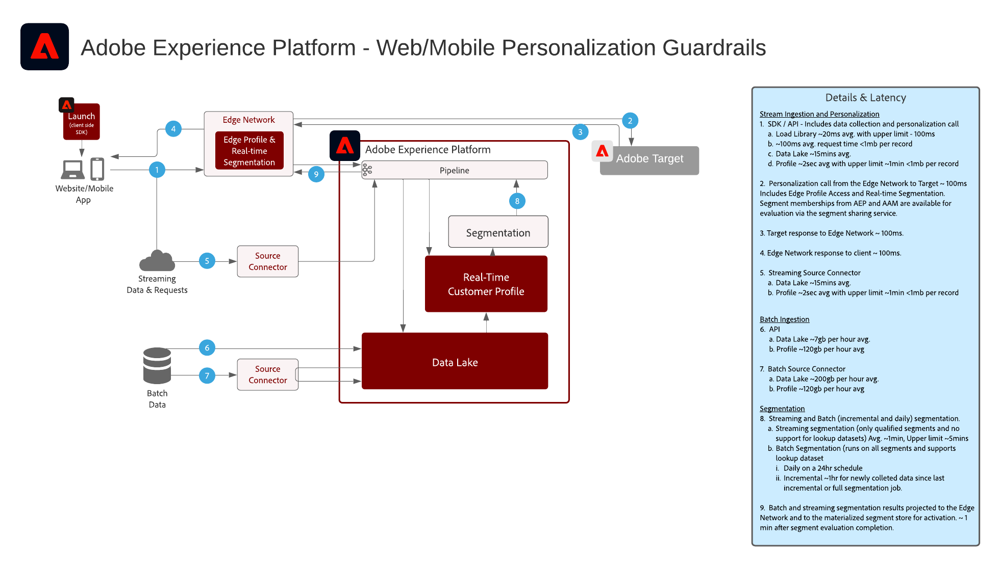

# 網路/行動個人化

Web和Mobile Personalization能夠跨多個應用程式使用個人資料和受眾細分來個性化和優化客戶體驗。 客戶行為、人口統計、忠誠度級別和以前的事務可用於個性化佈局、行動要求和內容。

 

| Blueprint | 說明 | Experience Cloud 應用程式 |
|---|---|---|
| **[行為網路/行動個人化](behavioral.md)** | <ul><li>基於線上行為及對象資料進行個人化</li></ul> | <ul><li>Adobe Target</li><li>Adobe Real-time Customer Data Platform *（可選）*</li><li>Adobe Analytics *(可選)*</li><li>Adobe Audience Manager *(可選)*</li></ul> |
| **[Web/移動個性化與已知客戶資料](known-personalization.md)** | <ul><li>完整的客戶配置檔案和增強的細分功能提供了改進的個性化體驗。</li><li>使用離線屬性和事件 (異動、保留、CRM 及忠誠度資料) 個人化。</li><li>在網路、電子郵件及其他已知的通道上同步個人化。</li></ul> | <ul><li>Adobe Target</li><li>[!UICONTROL 即時客戶資料平台]</li><li>Adobe Analytics *(可選)*</li><li>Adobe Audience Manager *(可選)*</li></ul> |

 

## 網路與行動個人化的護欄

[有關與受眾和配置檔案激活相關的護欄，請參閱配置檔案和分段護欄文檔。](https://experienceleague.adobe.com/docs/experience-platform/profile/guardrails.html?lang=zh-Hant)

 

### 已知客戶個性化護欄圖

## 相關部落格貼文

* [[!DNL Blueprint for Web Personalization using Adobe Experience Platform Real-Time Customer Profile]](https://medium.com/adobetech/blueprint-for-web-personalization-using-adobe-experience-platform-real-time-customer-profile-fef2ce7a4b2f)
* [[!DNL Integrating Adobe Experience Platform Decisioning Engine with AEM Websites]](https://jaeness.medium.com/integrating-adobe-experience-platform-decisioning-engine-with-aem-websites-9c222acd12e2)
* [[!DNL Content and Commerce AI: Personalizing Your Interactions with Customers Through Content Intelligence]](https://medium.com/adobetech/content-and-commerce-ai-personalizing-your-interactions-with-customers-through-content-intelligence-dc182601deab)
* [[!DNL How Adobe Experience Platform Predictive Audiences improves Personalized Experiences]](https://medium.com/adobetech/how-adobe-experience-platform-predictive-audiences-improves-personalized-experiences-1f75a60cb7a3)
* [[!DNL Adobe Experience Platform Web SDK for Audience Management]](https://medium.com/adobetech/adobe-experience-platform-web-sdk-for-audience-management-751fa6d063bc)
* [[!DNL Implementing Adobe Experience Platform Real-Time Customer Profile through our “Customer Zero” Program]](https://medium.com/adobetech/implementing-adobe-experience-platform-real-time-customer-profile-through-our-customer-zero-32e7cd952896)
* [[!DNL Segmentation in Seconds: How Adobe Experience Platform Made Real-time Customer Profiles a Reality]](https://medium.com/adobetech/segmentation-in-seconds-how-adobe-experience-platform-made-real-time-customer-profiles-a-reality-a7a8552b0847)
* [[!DNL Build an Optimal Online Experience: Enrich Unified Profile with Query Service]](https://medium.com/adobetech/build-an-optimal-online-experience-enrich-unified-profile-with-query-service-8027c196ab33)
